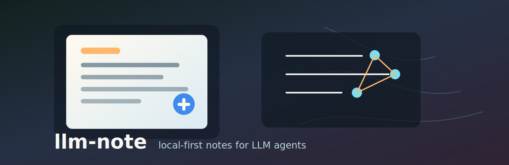

# llm-note

[](https://github.com/doc-bricks/llm-note/actions/workflows/ci.yml)
[](LICENSE)
[](pyproject.toml)

[Deutsch](README_de.md) · [Español](README_es.md) · [简体中文](README_zh-Hans.md) · [日本語](README_ja.md) · [Русский](README_ru.md)

**llm-note** is a local-first note engine for LLM agents. It gives agents and humans a small SQLite thought log plus plain-text notebook inboxes without hosted services, accounts, or external runtime dependencies.

The project was extracted from BACH's Notizblock and Denkarium patterns, then cleaned into a standalone Python package for public use.

## What It Does

- Store structured notes, logbook entries, categories, mood values, and promotion markers in SQLite.
- Keep portable plain-text notebooks for quick inbox notes and topic notebooks.
- Search notes from Python or the CLI.
- Start brainstorm entries that can later become tasks, wiki pages, or issues in a host system.
- Use six bundled message locales: German, English, Spanish, Simplified Chinese, Japanese, and Russian.
- Ship an agent skill that explains when and how to use the note workflow.

## Install

From a checkout:

```bash
git clone https://github.com/doc-bricks/llm-note.git
cd llm-note
pip install -e .
```

Runtime dependency note: llm-note uses only the Python standard library.

## CLI

```bash
llm-note write "Keep this repo privacy-clean before release" --cat release
llm-note read --limit 5
llm-note search privacy
llm-note brainstorm "next release"
llm-note stats
```

Use a custom database or locale:

```bash
llm-note --db data/notes.db --locale de write "Öffentliche README prüfen" --cat release
```

## Python API

```python
from llm_note import FileNotebookStore, NoteStore

notes = NoteStore("data/notes.db")
entry = notes.write("Investigate release checklist gaps", category="release")
print(notes.search("checklist"))
notes.promote(entry.id, "task")

notebooks = FileNotebookStore("notebooks")
notebooks.write("Buy milk\n#NB: Shopping List")
notebooks.transfer_marked_entries()
```

## Agent Skill

The standalone skill lives in [`skills/llm-note/SKILL.md`](skills/llm-note/SKILL.md). The raw BACH export that seeded it is preserved under [`references/bach-export/`](references/bach-export/) for provenance.

## Repository Layout

```text
llm_note/                  Python package
tests/                     Pytest suite
skills/llm-note/           Agent skill
plugin/                    Lightweight plugin metadata
references/bach-export/    Raw BACH skill export
references/bach-source/    Source snapshots used during extraction
docs/                      Additional documentation
assets/banner.svg          Repository banner
```

## Privacy Model

llm-note never talks to a network service by itself. Databases and notebook folders are local files, and `.gitignore` excludes them by default. Public releases should commit code, docs, tests, and skill metadata only.

## License

[MIT](LICENSE) - Copyright 2026 Lukas Geiger
