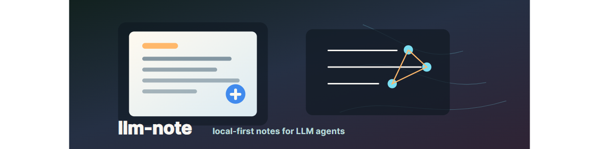
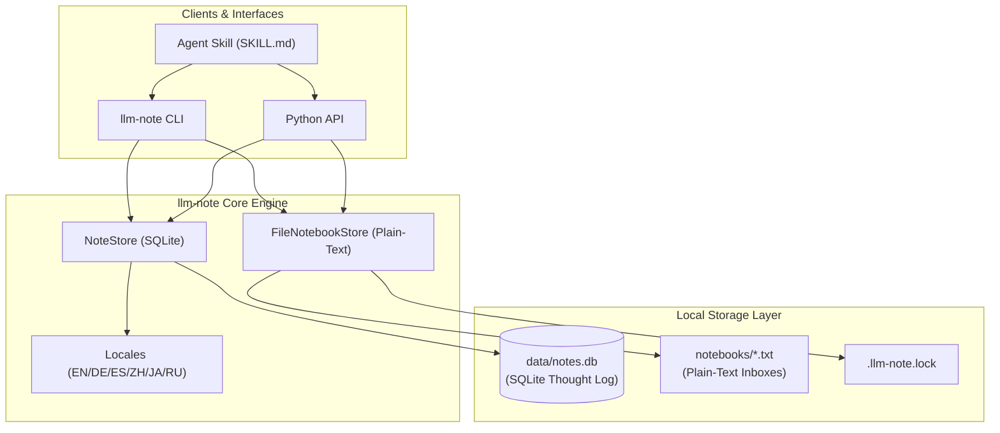

# llm-note

[](https://github.com/doc-bricks/llm-note/actions/workflows/ci.yml)
[](LICENSE)
[](pyproject.toml)
[](tests/)
[](https://github.com/doc-bricks)
[](https://github.com/open-bricks)

[Deutsch](README_de.md) · [English](README.md) · [Español](README_es.md) · [简体中文](README_zh-Hans.md) · [日本語](README_ja.md) · [Русский](README_ru.md)

> [!NOTE]
> **Privacy-First & Local-Only**: `llm-note` operates entirely on local SQLite and plain-text files. It requires zero API keys, no cloud servers, no vector database overhead, and makes no network connections. Ideal for secure, privacy-conscious AI agent workflows.

**llm-note** is a local-first note engine for LLM agents. It gives agents and humans a small SQLite thought log plus plain-text notebook inboxes without hosted services, accounts, or external runtime dependencies.

The project was extracted from BACH's Notizblock and Denkarium patterns, then cleaned into a standalone Python package for public use.

## System Architecture


```mermaid
graph TD
    subgraph Clients["Clients & Interfaces"]
        CLI["llm-note CLI"]
        PyAPI["Python API"]
        Skill["Agent Skill (SKILL.md)"]
    end

    subgraph CoreEngine["llm-note Core Engine"]
        NoteStore["NoteStore (SQLite)"]
        FileStore["FileNotebookStore (Plain-Text)"]
        I18N["Locales (EN/DE/ES/ZH/JA/RU)"]
    end

    subgraph LocalStorage["Local Storage Layer"]
        DB[("data/notes.db<br/>(SQLite Thought Log)")]
        Notebooks["notebooks/*.txt<br/>(Plain-Text Inboxes)"]
        LockFile[".llm-note.lock"]
    end

    CLI --> NoteStore
    CLI --> FileStore
    PyAPI --> NoteStore
    PyAPI --> FileStore
    Skill --> CLI
    Skill --> PyAPI

    NoteStore --> DB
    NoteStore --> I18N
    FileStore --> Notebooks
    FileStore --> LockFile
```

## Start Here

Use llm-note when you need a small, auditable memory layer for agents, coding assistants, research workflows, or private notebooks:

| Need | Use llm-note for |
| --- | --- |
| Agent memory | Record decisions, observations, and follow-up markers in local SQLite. |
| Notebook inbox | Keep plain-text notes that can be reviewed, transferred, or archived later. |
| Privacy-first workflow | Avoid hosted note services, accounts, embeddings, and background network calls. |
| Skill packaging | Ship a reusable note-taking skill beside the Python package. |

## What It Does

- Store structured notes, logbook entries, categories, mood values, and promotion markers in SQLite.
- Keep portable plain-text notebooks for quick inbox notes and topic notebooks.
- Search notes from Python or the CLI.
- Start brainstorm entries that can later become tasks, wiki pages, or issues in a host system.
- Use six bundled message locales: German, English, Spanish, Simplified Chinese, Japanese, and Russian.
- Ship an agent skill that explains when and how to use the note workflow.

## Install

From a checkout:

```bash
git clone https://github.com/doc-bricks/llm-note.git
cd llm-note
pip install -e .
```

Runtime dependency note: llm-note uses only the Python standard library.

## CLI

```bash
llm-note write "Keep this repo privacy-clean before release" --cat release
llm-note read --limit 5
llm-note search privacy
llm-note brainstorm "next release"
llm-note stats
```

Use a custom database or locale:

```bash
llm-note --db data/notes.db --locale de write "Öffentliche README prüfen" --cat release
```

## Python API

```python
from llm_note import FileNotebookStore, NoteStore

notes = NoteStore("data/notes.db")
entry = notes.write("Investigate release checklist gaps", category="release")
print(notes.search("checklist"))
notes.promote(entry.id, "task")

notebooks = FileNotebookStore("notebooks")
notebooks.write("Buy milk\n#NB: Shopping List")
notebooks.transfer_marked_entries()
```

Search terms are literal: `%` and `_` do not act as SQL wildcards. API and CLI
query limits accept values from `0` through `1000`.

`FileNotebookStore` keeps Unicode notebook names and serializes reads, writes,
and transfers across local processes. It leaves a small `.llm-note.lock` file in
the notebook root for coordination; keep that file in place while clients may be
running. Pending transfers receive a `#LLM-NOTE-ID` line so a retry after an
interrupted file operation cannot duplicate the entry.

## Agent Skill

The standalone skill lives in [`skills/llm-note/SKILL.md`](skills/llm-note/SKILL.md). The raw BACH export that seeded it is preserved under [`references/bach-export/`](references/bach-export/) for provenance.

## Positioning

llm-note is intentionally smaller than full knowledge-base systems such as Obsidian, Joplin, NotebookLM, vector databases, or MCP notebook servers. It is a local Python package for agent notes, CLI notebooks, and reproducible logbooks that should stay inspectable in Git and easy to embed in another tool.

Useful search phrases for this repository include `local-first LLM notes`, `SQLite note store for agents`, `agent notebook CLI`, `private AI notebook`, `LLM memory logbook`, and `BACH Notizblock extraction`.

## Repository Layout

```text
llm_note/                  Python package
tests/                     Pytest suite
skills/llm-note/           Agent skill
plugin/                    Lightweight plugin metadata
references/bach-export/    Raw BACH skill export
references/bach-source/    Source snapshots used during extraction
docs/                      Additional documentation
assets/banner.png          Repository banner
```

## Privacy Model

llm-note never talks to a network service by itself. Databases, notebook folders,
and notebook lock files are local data, and `.gitignore` excludes the default
locations. Public releases should commit code, docs, tests, and skill metadata
only.

## License

[MIT](LICENSE) - Copyright 2026 Lukas Geiger
