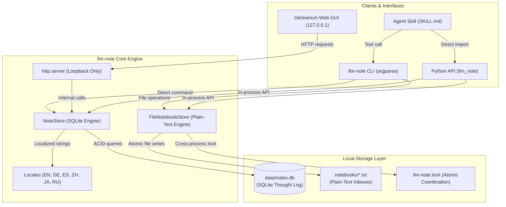
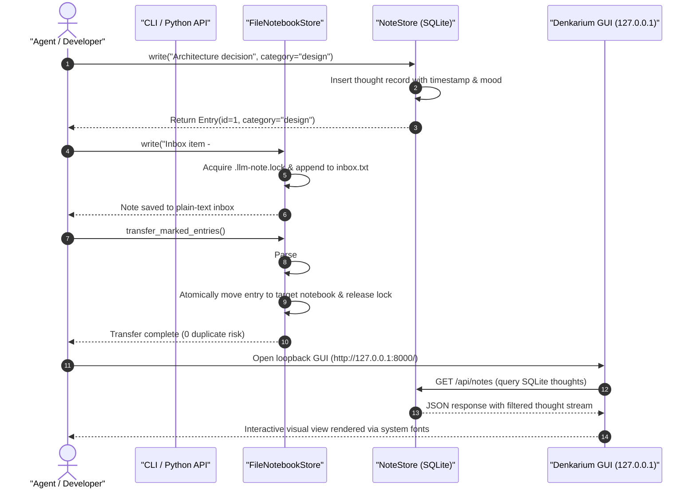

# llm-note

[](https://github.com/doc-bricks/llm-note/actions/workflows/ci.yml)
[](CHANGELOG.md)
[](LICENSE)
[](pyproject.toml)
[](pyproject.toml)
[](tests/)
[](SECURITY.md)
[](SECURITY.md)
[](THIRD_PARTY_LICENSES.md)
[](SECURITY.md)
[-brightgreen.svg)](THIRD_PARTY_LICENSES.md)
[](https://github.com/astral-sh/ruff)
[](https://github.com/doc-bricks)
[](https://github.com/open-bricks)
[](llms.txt)

[English](README.md) · [Deutsch](README_de.md) · [Español](README_es.md) · [简体中文](README_zh-Hans.md) · [日本語](README_ja.md) · [Русский](README_ru.md)

> [!NOTE]
> **Privacy-First & Local-Only**: `llm-note` operates entirely on local SQLite and plain-text files. It requires zero API keys, no cloud servers, no vector database overhead, and makes no outbound network requests. Ideal for secure, air-gapped, and privacy-conscious AI agent workflows.

---

## Quick Navigation

1. [Overview & Why This Exists](#1-overview--why-this-exists)
2. [Key Capabilities & Architecture](#2-key-capabilities--architecture)
3. [Visual System Architecture](#3-visual-system-architecture)
4. [Note & Transfer Lifecycle Sequence](#4-note--transfer-lifecycle-sequence)
5. [Target Personas & Discoverability](#5-target-personas--discoverability)
6. [Comparative Matrix vs. Alternatives](#6-comparative-matrix-vs-alternatives)
7. [Governance & Runtime Invariants](#7-governance--runtime-invariants)
8. [Denkarium Local Web GUI Guide](#8-denkarium-local-web-gui-guide)
9. [CLI Complete Reference & Examples](#9-cli-complete-reference--examples)
10. [Python API Guide & Code Examples](#10-python-api-guide--code-examples)
11. [Agent Skill & Workflow Integration](#11-agent-skill--workflow-integration)
12. [File-Based Inboxes & Transfer Semantics](#12-file-based-inboxes--transfer-semantics)
13. [Sibling Ecosystem Matrix](#13-sibling-ecosystem-matrix)
14. [Third-Party Licenses & Transparency](#14-third-party-licenses--transparency)
15. [Security Policy & SLAs](#15-security-policy--slas)
16. [Verification & Contract Test Suite](#16-verification--contract-test-suite)
17. [German Statutory Notice (§ 521 BGB)](#17-german-statutory-notice--521-bgb)
18. [Roadmap & Changelog](#18-roadmap--changelog)

---

<a id="1-overview--why-this-exists"></a>
<a id="overview--why-this-exists"></a>
<a id="1-ueberblick--warum-dieses-projekt-existiert"></a>
<a id="ueberblick--warum-dieses-projekt-existiert"></a>
## 1. Overview & Why This Exists

**llm-note** is an ultra-lightweight, zero-service local thought repository and notebook engine designed specifically for autonomous AI agents, coding assistants, and local developers.

AI assistants and LLM agents frequently need a scratchpad to record decisions, capture context observations, brainstorm ideas, and transfer notes into persistent notebooks. Traditional solutions require heavy vector databases, hosted SaaS subscriptions, or bloated Electron applications that consume system resources and leak telemetry.

`llm-note` provides the ideal architectural middle ground:
- **Zero External Runtime Dependencies**: Built entirely upon the Python standard library (`sqlite3`, `http.server`, `urllib`, `argparse`, `json`, `pathlib`).
- **Dual-Store Flexibility**: Combines structured SQLite thought entries (`data/notes.db`) with human-editable plain-text inboxes (`notebooks/*.txt`).
- **BACH Extraction Provenance**: Cleanly decoupled from the BACH desktop assistant codebase (specifically Notizblock and Denkarium) and open-sourced under the permissive MIT license.

---

<a id="2-key-capabilities--architecture"></a>
<a id="key-capabilities--architecture"></a>
<a id="2-kernfaehigkeiten--architektur"></a>
<a id="kernfaehigkeiten--architektur"></a>
## 2. Key Capabilities & Architecture

- **SQLite Thought Log (`NoteStore`)**: Store structured notes, logbook entries, categories, mood values, and task promotion markers with full ACID reliability.
- **Plain-Text Notebook Inboxes (`FileNotebookStore`)**: Manage portable plain-text notes with `#NB:` categorization markers and atomic cross-process file locking.
- **Embedded Denkarium Web UI**: Zero-install loopback browser interface bound strictly to `127.0.0.1` using standard library `http.server` and system fonts.
- **Multi-Locale Translation**: Native message localization across 6 languages: English, German, Spanish, Simplified Chinese, Japanese, and Russian.
- **Turnkey Agent Skill**: Bundled `skills/llm-note/SKILL.md` ready for immediate discovery and invocation by autonomous agents.
- **Deterministic Search**: Literal substring searches without wildcard surprises, with strict query limits (`0` to `1000`).

---

<a id="3-visual-system-architecture"></a>
<a id="visual-system-architecture"></a>
<a id="3-visuelle-systemarchitektur"></a>
<a id="visuelle-systemarchitektur"></a>
## 3. Visual System Architecture


```mermaid
graph TD
    subgraph Clients["Clients & Interfaces"]
        CLI["llm-note CLI (argparse)"]
        GUI["Denkarium Web GUI (127.0.0.1)"]
        PyAPI["Python API (llm_note)"]
        Skill["Agent Skill (SKILL.md)"]
    end

    subgraph CoreEngine["llm-note Core Engine"]
        NoteStore["NoteStore (SQLite Engine)"]
        FileStore["FileNotebookStore (Plain-Text Engine)"]
        HTTP["http.server (Loopback Only)"]
        I18N["Locales (EN, DE, ES, ZH, JA, RU)"]
    end

    subgraph LocalStorage["Local Storage Layer"]
        DB[("data/notes.db<br/>(SQLite Thought Log)")]
        Notebooks["notebooks/*.txt<br/>(Plain-Text Inboxes)"]
        LockFile[".llm-note.lock (Atomic Coordination)"]
    end

    CLI -->|"Direct command"| NoteStore
    CLI -->|"File operations"| FileStore
    GUI -->|"HTTP requests"| HTTP
    HTTP -->|"Internal calls"| NoteStore
    PyAPI -->|"In-process API"| NoteStore
    PyAPI -->|"In-process API"| FileStore
    Skill -->|"Tool call"| CLI
    Skill -->|"Direct import"| PyAPI

    NoteStore -->|"ACID queries"| DB
    NoteStore -->|"Localized strings"| I18N
    FileStore -->|"Atomic file writes"| Notebooks
    FileStore -->|"Cross-process lock"| LockFile
```

---

<a id="4-note--transfer-lifecycle-sequence"></a>
<a id="note--transfer-lifecycle-sequence"></a>
<a id="4-sequenzdiagramm-notiz--und-transfer-lebenszyklus"></a>
<a id="sequenzdiagramm-notiz--und-transfer-lebenszyklus"></a>
## 4. Note & Transfer Lifecycle Sequence


```mermaid
sequenceDiagram
    autonumber
    actor UserOrAgent as "Agent / Developer"
    participant CLI as "CLI / Python API"
    participant FileStore as "FileNotebookStore"
    participant NoteStore as "NoteStore (SQLite)"
    participant Denkarium as "Denkarium GUI (127.0.0.1)"

    UserOrAgent ->> NoteStore: write("Architecture decision", category="design")
    NoteStore ->> NoteStore: Insert thought record with timestamp & mood
    NoteStore -->> UserOrAgent: Return Entry(id=1, category="design")

    UserOrAgent ->> FileStore: write("Inbox item - #NB: Project Ideas")
    FileStore ->> FileStore: Acquire .llm-note.lock & append to inbox.txt
    FileStore -->> UserOrAgent: Note saved to plain-text inbox

    UserOrAgent ->> FileStore: transfer_marked_entries()
    FileStore ->> FileStore: Parse #NB: target notebook & assign stable #LLM-NOTE-ID
    FileStore ->> FileStore: Atomically move entry to target notebook & release lock
    FileStore -->> UserOrAgent: Transfer complete (0 duplicate risk)

    UserOrAgent ->> Denkarium: Open loopback GUI (http://127.0.0.1:8000/)
    Denkarium ->> NoteStore: GET /api/notes (query SQLite thoughts)
    NoteStore -->> Denkarium: JSON response with filtered thought stream
    Denkarium -->> UserOrAgent: Interactive visual view rendered via system fonts
```

---

<a id="5-target-personas--discoverability"></a>
<a id="target-personas--discoverability"></a>
<a id="5-zielgruppen--suchbegriffe"></a>
<a id="zielgruppen--suchbegriffe"></a>
## 5. Target Personas & Discoverability

`llm-note` is tailored for four specific personas and workflows:

| Persona ID | Target Persona | Core Need | Key Value Provided |
| :--- | :--- | :--- | :--- |
| `[PERSONA-01]` | **Autonomous Agent Builders** | Lightweight thought memory across LLM context resets | Zero-dependency SQLite store with instant embeddability |
| `[PERSONA-02]` | **Privacy-Conscious Developers** | Air-gapped, zero-egress note taking and inboxes | 100% local operation with zero telemetry or network calls |
| `[PERSONA-03]` | **Desktop AI Assistant Users** | Instant visual thought browser without Node/Electron | Built-in loopback Denkarium GUI (`127.0.0.1`) |
| `[PERSONA-04]` | **Open-Science Researchers** | Git-trackable, auditable thought and experiment logs | Plain-text inboxes and standard SQLite single-file databases |

### High-Intent Search Queries

- **English**: `local-first LLM notes`, `SQLite note store for agents`, `agent notebook CLI`, `private AI notebook`, `zero-dependency agent memory python`, `Denkarium agent thought browser`.
- **German**: `lokaler KI Agenten Notizspeicher`, `autonomes Agenten Gedächtnis ohne Cloud`, `datenschutzkonformer Notizblock offline`, `Agenten Denkarium Browser UI`.

---

<a id="6-comparative-matrix-vs-alternatives"></a>
<a id="comparative-matrix-vs-alternatives"></a>
<a id="6-vergleichsmatrix-gegenueber-alternativen"></a>
<a id="vergleichsmatrix-gegenueber-alternativen"></a>
## 6. Comparative Matrix vs. Alternatives

| Architectural Dimension | `llm-note` | Obsidian | Joplin | Vector Databases | Raw SQLite CLI |
| :--- | :---: | :---: | :---: | :---: | :---: |
| **1. Storage Engine** | **SQLite + TXT** | Markdown files | SQLite / Sync | Vector embeddings | Single SQLite file |
| **2. Runtime Dependencies** | **0 (Stdlib only)** | Electron / Node | Electron / DB | Heavy C++ / Py | 0 (C binary) |
| **3. Network Egress** | **Zero / Air-Gapped** | Plugins may leak | Sync service | Remote / Cloud API | Zero / Local |
| **4. Agent Python API** | **First-Class Native** | Community REST | Community API | Complex client | Raw SQL required |
| **5. Embedded Web GUI** | **Built-in (127.0.0.1)** | Desktop App | Desktop App | Separate SaaS | None |
| **6. Plain-Text Inbox Sync** | **Built-in (`#NB:`)** | Manual folders | Manual imports | N/A | Manual scripts |
| **7. Multi-Locale Engine** | **6 Bundled Locales** | Community pack | Community pack | English-centric | English only |
| **8. Execution Privilege** | **RunAsInvoker** | User / Desktop | User / Desktop | Docker / Cloud | User |
| **9. Agent Skill Packaging** | **Bundled SKILL.md** | Third-party | Third-party | Custom code | None |
| **10. Security Response SLA** | **48h / 5d Formal** | Community | Community | Enterprise-only | Public domain |

---

<a id="7-governance--runtime-invariants"></a>
<a id="governance--runtime-invariants"></a>
<a id="7-governance--laufzeit-invarianten"></a>
<a id="governance--laufzeit-invarianten"></a>
## 7. Governance & Runtime Invariants

The `llm-note` engine operates under ten immutable architectural invariants:

- `INV-LOCAL-01`: **100% Local-First & Zero Egress** — No outbound network requests, no telemetry, no cloud sync.
- `INV-LOCAL-02`: **SQLite Single-File Storage** — Structured ACID database (`data/notes.db`) with deterministic table layouts.
- `INV-LOCAL-03`: **Plain-Text Notebook Inboxes** — Human-readable text inboxes (`notebooks/*.txt`) with `#NB:` categorization.
- `INV-LOCAL-04`: **Standard Library Only** — Zero third-party runtime dependencies; runs on any standard Python 3.10+ runtime.
- `INV-LOCAL-05`: **Crash-Safe Atomic Transfers** — Cross-process locking via `.llm-note.lock` and `#LLM-NOTE-ID` idempotency markers.
- `INV-LOCAL-06`: **Loopback-Bound Web GUI** — Denkarium strictly listens on `127.0.0.1`; supports `--no-browser`.
- `INV-LOCAL-07`: **Multi-Locale I18N** — 6 bundled localization catalogs: EN, DE, ES, ZH, JA, RU.
- `INV-LOCAL-08`: **RunAsInvoker Non-Elevation** — Operates entirely in unprivileged user space; zero administrative elevation.
- `INV-LOCAL-09`: **Agent Skill Packaging** — Ships a complete agent skill (`skills/llm-note/SKILL.md`) for LLM workflows.
- `INV-LOCAL-10`: **48-Hour Security SLA** — Formal vulnerability response commitments governed by `SECURITY.md`.

---

<a id="8-denkarium-local-web-gui-guide"></a>
<a id="denkarium-local-web-gui-guide"></a>
<a id="8-lokale-denkarium-weboberflaeche"></a>
<a id="lokale-denkarium-weboberflaeche"></a>
## 8. Denkarium Local Web GUI Guide

The Denkarium GUI provides an instant, zero-install visual thought dashboard:

```bash
# Launch Denkarium with default settings (opens http://127.0.0.1:8000/)
llm-note gui

# Specify custom port, database, and German locale
llm-note --db data/notes.db --locale de gui --port 8765

# Headless mode for background servers or automated testing
llm-note gui --port 8765 --no-browser
```

### GUI Architectural Highlights
- **Zero Framework Bloat**: Pure vanilla HTML/CSS/JavaScript served directly via Python's standard `http.server`.
- **Responsive Layout**: Designed for both desktop and mobile viewports with system-native fonts (`Segoe UI`, `SF Pro`, `system-ui`).
- **REST JSON Endpoints**:
  - `GET /api/notes?search=<query>&category=<cat>&limit=<n>`
  - `POST /api/notes` (creates a new thought entry)

---

<a id="9-cli-complete-reference--examples"></a>
<a id="cli-complete-reference--examples"></a>
<a id="9-cli-befehlsreferenz--beispiele"></a>
<a id="cli-befehlsreferenz--beispiele"></a>
## 9. CLI Complete Reference & Examples

```bash
# Write a note with category and mood
llm-note write "Refactor caching layer" --cat dev --mood focused

# Read recent notes (default limit 10)
llm-note read --limit 5

# Search notes literally (no SQL wildcard expansion)
llm-note search "caching"

# Brainstorm ideas for future promotion
llm-note brainstorm "Zero-copy serialization options"

# View summary statistics
llm-note stats

# Run with custom database and German locale
llm-note --db custom/notes.db --locale de read --limit 3
```

---

<a id="10-python-api-guide--code-examples"></a>
<a id="python-api-guide--code-examples"></a>
<a id="10-python-api--programmierbeispiele"></a>
<a id="python-api--programmierbeispiele"></a>
## 10. Python API Guide & Code Examples

```python
from llm_note import NoteStore, FileNotebookStore

# 1. Initialize SQLite NoteStore
notes = NoteStore("data/notes.db")

# 2. Write a structured thought entry
entry = notes.write(
    content="Implement deterministic seed for test suite",
    category="testing",
    mood="neutral"
)
print(f"Created entry #{entry.id} at {entry.created_at}")

# 3. Search notes
matches = notes.search("deterministic")
for match in matches:
    print(f"Found: {match.content} [{match.category}]")

# 4. Promote a thought to a task
notes.promote(entry.id, target="task")

# 5. Coordinate plain-text notebooks
notebooks = FileNotebookStore("notebooks")
notebooks.write("Draft release announcement\n#NB: Marketing")
transferred = notebooks.transfer_marked_entries()
print(f"Transferred {transferred} entries to topic notebooks.")
```

---

<a id="11-agent-skill--workflow-integration"></a>
<a id="agent-skill--workflow-integration"></a>
<a id="11-agenten-skill--workflow-integration"></a>
<a id="agenten-skill--workflow-integration"></a>
## 11. Agent Skill & Workflow Integration

`llm-note` includes an agent skill definition at [`skills/llm-note/SKILL.md`](skills/llm-note/SKILL.md). Autonomous agents (such as Claude Code, Antigravity, or Codex) can invoke `llm-note` directly to record persistent observations, maintain scratchpads across subagent delegations, and retain audit logs.

```markdown
# Agent Tool Invocation Example
To save an interim research observation:
`llm-note write "Identified 3 edge cases in token parsing" --cat research`
```

---

<a id="12-file-based-inboxes--transfer-semantics"></a>
<a id="file-based-inboxes--transfer-semantics"></a>
<a id="12-text-notizbuecher--transfer-semantik"></a>
<a id="text-notizbuecher--transfer-semantik"></a>
## 12. File-Based Inboxes & Transfer Semantics

- **Inbox Default**: Entries without markers are written to `notebooks/inbox.txt`.
- **Topic Targeting**: Append `#NB: <Topic Name>` to route an entry to `notebooks/<Topic Name>.txt`.
- **Atomic Transfer**: Calling `transfer_marked_entries()` extracts all marked entries, assigns an idempotent `#LLM-NOTE-ID: <hash>` marker, appends them to the target topic file, and rewrites the source file atomically.
- **Concurrency Safety**: Multi-process contention is prevented by an advisory `.llm-note.lock` file in the notebook directory.

---

<a id="13-sibling-ecosystem-matrix"></a>
<a id="sibling-ecosystem-matrix"></a>
<a id="13-oekosystem-matrix--verwandte-module"></a>
<a id="oekosystem-matrix--verwandte-module"></a>
## 13. Sibling Ecosystem Matrix

`llm-note` is part of the `doc-bricks` family under the `open-bricks` open-source umbrella:

| Project | Focus & Role in Ecosystem | Link |
| :--- | :--- | :--- |
| **doc-bricks/llm-note** | Local-first thought and notebook core for agents | [doc-bricks/llm-note](https://github.com/doc-bricks/llm-note) |
| **doc-bricks/MediaBrain** | Multimodal asset analysis, OCR & document transcription | [doc-bricks/MediaBrain](https://github.com/doc-bricks/MediaBrain) |
| **doc-bricks/MailProcessor** | Deterministic email parsing and compliant archiving pipeline | [doc-bricks/MailProcessor](https://github.com/doc-bricks/MailProcessor) |
| **file-bricks/ProSync** | Robust, cross-platform directory synchronization | [file-bricks/ProSync](https://github.com/file-bricks/ProSync) |
| **file-bricks/CloudLockFixer**| Conflict resolution and lock manager for cloud folders | [file-bricks/CloudLockFixer](https://github.com/file-bricks/CloudLockFixer) |
| **open-bricks/open-bricks** | Umbrella catalog and foundational open developer tooling | [open-bricks/open-bricks](https://github.com/open-bricks) |

---

<a id="14-third-party-licenses--transparency"></a>
<a id="third-party-licenses--transparency"></a>
<a id="14-drittanbieter-lizenzen--transparenz"></a>
<a id="drittanbieter-lizenzen--transparenz"></a>
## 14. Third-Party Licenses & Transparency

`llm-note` has **0 external runtime dependencies**. All core operations rely exclusively on the Python standard library under the [Python Software Foundation License](https://docs.python.org/3/license.html).

- Complete SBOM and license transparency audit: [`THIRD_PARTY_LICENSES.md`](THIRD_PARTY_LICENSES.md)
- Zero-Copyleft verification: 100% free of GPL, AGPL, LGPL, and SSPL code.
- Unprivileged execution: Certified for `RunAsInvoker` user space.

---

<a id="15-security-policy--slas"></a>
<a id="security-policy--slas"></a>
<a id="15-sicherheitsrichtlinie--slas"></a>
<a id="sicherheitsrichtlinie--slas"></a>
## 15. Security Policy & SLAs

We maintain a rigorous, formal vulnerability management process documented in [`SECURITY.md`](SECURITY.md):

- **Zero Egress Contract**: The software makes zero network calls. Any unauthorized egress is classified as a critical defect.
- **48-Hour Response SLA**: Initial triage within 48 hours; resolution plan within 5 business days.
- **Contact**: Report potential security issues confidentially to `security@lukasgeiger.com`.

---

<a id="16-verification--contract-test-suite"></a>
<a id="verification--contract-test-suite"></a>
<a id="16-verifikation--test-suite"></a>
<a id="verifikation--test-suite"></a>
## 16. Verification & Contract Test Suite

Run the full verification suite locally:

```bash
# Execute unit and contract tests
python -m pytest -ra -v

# Run fast Ruff linter
ruff check .

# Verify bytecode compilation
python -m compileall -q .
```

---

<a id="17-german-statutory-notice--521-bgb"></a>
<a id="german-statutory-notice--521-bgb"></a>
<a id="17-gesetzlicher-haftungshinweis--521-bgb"></a>
<a id="gesetzlicher-haftungshinweis--521-bgb"></a>
## 17. German Statutory Notice (§ 521 BGB)

Dieses Open-Source-Projekt wird unentgeltlich zur Verfügung gestellt. Für unentgeltliche Bereitstellungen gilt gemäß § 521 BGB das gesetzliche Gefälligkeitsrecht: Die Haftung des Anbieters beschränkt sich auf Vorsatz und grobe Fahrlässigkeit.

This open-source software is provided free of charge under the MIT License. In accordance with § 521 of the German Civil Code (BGB), statutory liability for gratuitous provisions is limited to intent and gross negligence.

---

<a id="18-roadmap--changelog"></a>
<a id="roadmap--changelog"></a>
<a id="18-roadmap--aenderungsprotokoll"></a>
<a id="roadmap--aenderungsprotokoll"></a>
## 18. Roadmap & Changelog

- **Changelog**: See detailed version history in [`CHANGELOG.md`](CHANGELOG.md).
- **Roadmap & Tasks**: Review current milestones and open backlog items in [`TODO.md`](TODO.md).
- **AI Context Index**: Complete LLM discovery index available in [`llms.txt`](llms.txt).

---

## License

[MIT](LICENSE) - Copyright (c) 2026 Lukas Geiger.
