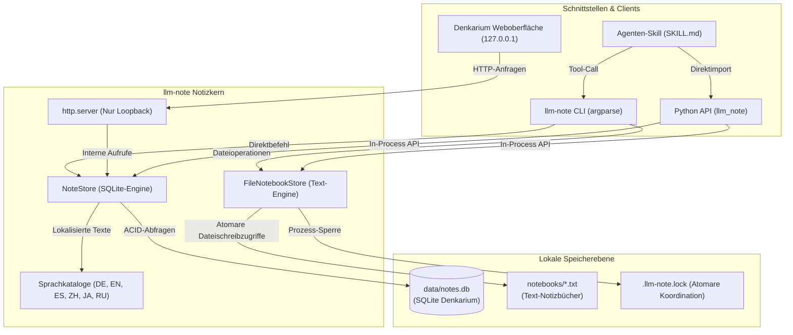
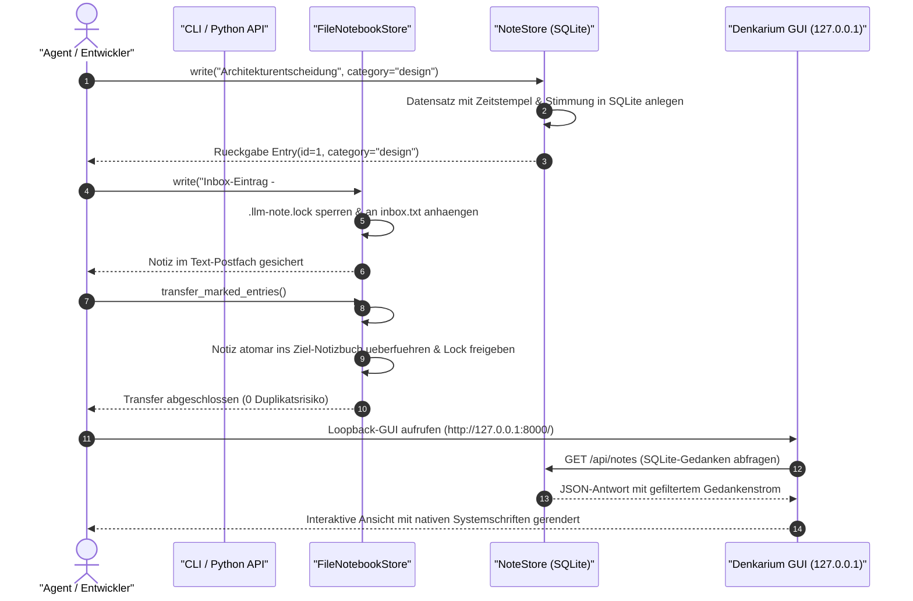

# llm-note

[](https://github.com/doc-bricks/llm-note/actions/workflows/ci.yml)
[](CHANGELOG.md)
[](LICENSE)
[](pyproject.toml)
[](pyproject.toml)
[](tests/)
[](SECURITY.md)
[](SECURITY.md)
[](THIRD_PARTY_LICENSES.md)
[](SECURITY.md)
[-brightgreen.svg)](THIRD_PARTY_LICENSES.md)
[](https://github.com/astral-sh/ruff)
[](https://github.com/doc-bricks)
[](https://github.com/open-bricks)
[](llms.txt)

[Deutsch](README_de.md) · [English](README.md) · [Español](README_es.md) · [简体中文](README_zh-Hans.md) · [日本語](README_ja.md) · [Русский](README_ru.md)

> [!NOTE]
> **Datenschutz & Lokal-Zuerst**: `llm-note` arbeitet vollständig auf lokalen SQLite-Datenbanken und einfachen Textdateien. Es benötigt keine API-Schlüssel, keine Cloud-Server, keinen Vektordatenbank-Overhead und stellt keine ausgehenden Netzwerkverbindungen her. Ideal für datenschutzkonforme, autarke KI-Agenten-Workflows.

---

## Schnellnavigation

1. [Überblick & Warum dieses Projekt existiert](#1-ueberblick--warum-dieses-projekt-existiert)
2. [Kernfähigkeiten & Architektur](#2-kernfaehigkeiten--architektur)
3. [Visuelle Systemarchitektur & Datenfluss](#3-visuelle-systemarchitektur)
4. [Sequenzdiagramm: Notiz- & Transfer-Lebenszyklus](#4-sequenzdiagramm-notiz--und-transfer-lebenszyklus)
5. [Zielgruppen & High-Intent Suchbegriffe](#5-zielgruppen--suchbegriffe)
6. [Vergleichsmatrix gegenüber Alternativen](#6-vergleichsmatrix-gegenueber-alternativen)
7. [Governance & Laufzeit-Invarianten](#7-governance--laufzeit-invarianten)
8. [Lokale Denkarium-Weboberfläche](#8-lokale-denkarium-weboberflaeche)
9. [CLI-Befehlsreferenz & Praxisbeispiele](#9-cli-befehlsreferenz--beispiele)
10. [Python API & Programmierbeispiele](#10-python-api--programmierbeispiele)
11. [Agenten-Skill & Workflow-Integration](#11-agenten-skill--workflow-integration)
12. [Text-Notizbücher & Transfer-Semantik](#12-text-notizbuecher--transfer-semantik)
13. [Ökosystem-Matrix & Verwandte Module](#13-oekosystem-matrix--verwandte-module)
14. [Drittanbieter-Lizenzen & Transparenz](#14-drittanbieter-lizenzen--transparenz)
15. [Sicherheitsrichtlinie & SLAs](#15-sicherheitsrichtlinie--slas)
16. [Verifikation & Test-Suite](#16-verifikation--test-suite)
17. [Gesetzlicher Haftungshinweis nach § 521 BGB](#17-gesetzlicher-haftungshinweis--521-bgb)
18. [Roadmap & Änderungsprotokoll](#18-roadmap--aenderungsprotokoll)

---

<a id="1-overview--why-this-exists"></a>
<a id="overview--why-this-exists"></a>
<a id="1-ueberblick--warum-dieses-projekt-existiert"></a>
<a id="ueberblick--warum-dieses-projekt-existiert"></a>
## 1. Überblick & Warum dieses Projekt existiert

**llm-note** ist ein extrem schlanker, dienstloser lokaler Notiz- und Gedankenspeicher für autonome KI-Agenten, Coding-Assistenten und Entwickler.

Autonome Agenten und LLMs benötigen während komplexer Arbeitsläufe fortlaufend einen schnellen Notizblock: zur Dokumentation von Entwurfsentscheidungen, für Zwischenbeobachtungen, Brainstorming-Einträge oder zur Ablage in dauerhaften Themen-Notizbüchern. Herkömmliche Lösungen setzen häufig schwere Vektordatenbanken, kostenpflichtige SaaS-Dienste oder ressourcenintensive Electron-Apps voraus, die Telemetriedaten übertragen.

`llm-note` schließt diese Lücke:
- **Null externe Laufzeitabhängigkeiten**: 100% reine Python-Standardbibliothek (`sqlite3`, `http.server`, `urllib`, `argparse`, `json`, `pathlib`).
- **Duale Speicherarchitektur**: Verbindet strukturierte SQLite-Gedanken (`data/notes.db`) mit flexiblen, Git-fähigen Klartext-Notizbüchern (`notebooks/*.txt`).
- **BACH-Provenienz**: Sauber entkoppelt aus den bewährten Notizblock- und Denkarium-Komponenten des BACH-Assistentensystems und unter der permissiven MIT-Lizenz freigegeben.

---

<a id="2-key-capabilities--architecture"></a>
<a id="key-capabilities--architecture"></a>
<a id="2-kernfaehigkeiten--architektur"></a>
<a id="kernfaehigkeiten--architektur"></a>
## 2. Kernfähigkeiten & Architektur

- **SQLite-Denkarium (`NoteStore`)**: Strukturierte Notizen, Logbuch-Einträge, Kategorien, Stimmungswerte und Beförderungs-Marker mit voller ACID-Transaktionssicherheit speichern.
- **Textdatei-Notizbücher (`FileNotebookStore`)**: Portable Text-Notizbücher mit `#NB:`-Kategorisierung und atomarer prozessübergreifender Dateisperre (`.llm-note.lock`).
- **Integrierte Denkarium-Weboberfläche**: Sofort einsatzbereite Loopback-Benutzeroberfläche, strikt an `127.0.0.1` gebunden via `http.server` und mit nativen Systemschriften.
- **Mehrsprachige Lokalisierung**: 6 mitgelieferte Sprachkataloge: Deutsch, Englisch, Spanisch, vereinfachtes Chinesisch, Japanisch und Russisch.
- **Schlüsselfertiger Agenten-Skill**: Fertiges `skills/llm-note/SKILL.md` für die direkte Erkennung und Werkzeugnutzung durch autonome Agenten.
- **Deterministische Suche**: Exakte Teilstring-Suche ohne SQL-Wildcard-Überraschungen mit klar begrenzten Abfragemengen (`0` bis `1000`).

---

<a id="3-visual-system-architecture"></a>
<a id="visual-system-architecture"></a>
<a id="3-visuelle-systemarchitektur"></a>
<a id="visuelle-systemarchitektur"></a>
## 3. Visuelle Systemarchitektur & Datenfluss



---

<a id="4-note--transfer-lifecycle-sequence"></a>
<a id="note--transfer-lifecycle-sequence"></a>
<a id="4-sequenzdiagramm-notiz--und-transfer-lebenszyklus"></a>
<a id="sequenzdiagramm-notiz--und-transfer-lebenszyklus"></a>
## 4. Sequenzdiagramm: Notiz- & Transfer-Lebenszyklus



---

<a id="5-target-personas--discoverability"></a>
<a id="target-personas--discoverability"></a>
<a id="5-zielgruppen--suchbegriffe"></a>
<a id="zielgruppen--suchbegriffe"></a>
## 5. Zielgruppen & High-Intent Suchbegriffe

`llm-note` wurde für vier zentrale Anwendungsszenarien optimiert:

| Persona ID | Zielgruppe | Kernbedarf | Bereitgestellter Nutzen |
| :--- | :--- | :--- | :--- |
| `[PERSONA-01]` | **Autonome Agenten-Entwickler** | Gedankenspeicher über Kontext-Resets hinweg | Null-Abhängigkeiten SQLite-Speicher zur sofortigen Einbettung |
| `[PERSONA-02]` | **Datenschutzbewusste Entwickler** | Vollständig autarker Notizblock ohne Netzwerkzugriff | 100% lokaler Betrieb ohne Telemetrie oder Serveraufrufe |
| `[PERSONA-03]` | **Desktop-KI-Assistenten-Nutzer** | Schnelle visuelle Gedankenübersicht ohne Node/Electron | Integrierte Loopback Denkarium-Oberfläche (`127.0.0.1`) |
| `[PERSONA-04]` | **Open-Science-Forscher** | In Git versionierbare, auditierbare Notizen & Logbücher | Text-Dateien und standardkonforme SQLite-Einzeldateien |

### Relevante Suchbegriffe

- **Deutsch**: `lokaler KI Agenten Notizspeicher`, `autonomes Agenten Gedächtnis ohne Cloud`, `datenschutzkonformer Notizblock offline`, `Agenten Denkarium Browser UI`, `einfaches LLM Logbuch Python`.
- **Englisch**: `local-first LLM notes`, `SQLite note store for agents`, `agent notebook CLI`, `private AI notebook`, `zero-dependency agent memory python`, `Denkarium agent thought browser`.

---

<a id="6-comparative-matrix-vs-alternatives"></a>
<a id="comparative-matrix-vs-alternatives"></a>
<a id="6-vergleichsmatrix-gegenueber-alternativen"></a>
<a id="vergleichsmatrix-gegenueber-alternativen"></a>
## 6. Vergleichsmatrix gegenüber Alternativen

| Architektur-Dimension | `llm-note` | Obsidian | Joplin | Vektordatenbanken | Reine SQLite CLI |
| :--- | :---: | :---: | :---: | :---: | :---: |
| **1. Speicher-Engine** | **SQLite + TXT** | Markdown-Dateien | SQLite / Sync | Vektor-Embeddings | Einzelne SQLite-Datei |
| **2. Laufzeitabhängigkeiten** | **0 (Nur Stdlib)** | Electron / Node | Electron / DB | Schweres C++ / Py | 0 (C-Binary) |
| **3. Netzwerkzugriff** | **Zero / Air-Gapped** | Plugins unklar | Sync-Dienst | Remote- / Cloud-API | Zero / Lokal |
| **4. Agenten Python-API** | **Erstklassig Nativ** | Community REST | Community-API | Komplexe Clients | Reines SQL nötig |
| **5. Lokale Web-GUI** | **Integriert (127.0.0.1)**| Desktop-App | Desktop-App | Separates SaaS | Keine |
| **6. Text-Postfach Sync** | **Integriert (`#NB:`)** | Manuelle Ordner | Manueller Import | Nicht vorhanden | Manuelle Skripte |
| **7. Lokalisierung** | **6 Sprachdateien** | Community-Pack | Community-Pack | Meist nur Englisch | Nur Englisch |
| **8. Privilegienstufe** | **RunAsInvoker** | Benutzer / Desktop | Benutzer / Desktop | Docker / Cloud | Benutzer |
| **9. Agenten-Skill** | **SKILL.md inklusive** | Drittanbieter | Drittanbieter | Eigener Code | Keine |
| **10. Sicherheits-SLA** | **48h / 5d Verbindlich**| Community | Community | Nur Enterprise | Public Domain |

---

<a id="7-governance--runtime-invariants"></a>
<a id="governance--runtime-invariants"></a>
<a id="7-governance--laufzeit-invarianten"></a>
<a id="governance--laufzeit-invarianten"></a>
## 7. Governance & Laufzeit-Invarianten

`llm-note` garantiert zehn unveränderliche Systeminvarianten:

- `INV-LOCAL-01`: **100% Lokal-Zuerst & Zero Egress** — Keine ausgehenden Netzwerkaufrufe, keine Telemetrie, kein Cloud-Sync.
- `INV-LOCAL-02`: **SQLite-Einzeldatei-Speicher** — Strukturierte ACID-Datenbank (`data/notes.db`) mit deterministischem Schema.
- `INV-LOCAL-03`: **Klartext-Notizbuch-Postfächer** — Für Menschen lesbare Textdateien (`notebooks/*.txt`) mit `#NB:`-Kategorisierung.
- `INV-LOCAL-04`: **Ausschließlich Standardbibliothek** — Null externe Laufzeitabhängigkeiten; lauffähig auf jedem Standard-Python 3.10+.
- `INV-LOCAL-05`: **Absturzsichere atomare Transfers** — Dateisperren via `.llm-note.lock` und `#LLM-NOTE-ID`-Idempotenz-Marker.
- `INV-LOCAL-06`: **Strikte Loopback-Web-GUI** — Denkarium lauscht ausschließlich auf `127.0.0.1`; `--no-browser` Modus verfügbar.
- `INV-LOCAL-07`: **Mehrsprachigkeit (I18N)** — 6 vollständige Lokalisierungskataloge: DE, EN, ES, ZH, JA, RU.
- `INV-LOCAL-08`: **RunAsInvoker Unprivilegiert** — Läuft vollständig im Benutzerraum ohne administrative Rechte (keine UAC-Elevation).
- `INV-LOCAL-09`: **Fertiges Agenten-Skill-Paket** — Liefert `skills/llm-note/SKILL.md` für sofortige Werkzeugintegration mit.
- `INV-LOCAL-10`: **48-Stunden Sicherheits-SLA** — Verbindliche Reaktionszeiten bei Sicherheitsmeldungen gemäß `SECURITY.md`.

---

<a id="8-denkarium-local-web-gui-guide"></a>
<a id="denkarium-local-web-gui-guide"></a>
<a id="8-lokale-denkarium-weboberflaeche"></a>
<a id="lokale-denkarium-weboberflaeche"></a>
## 8. Lokale Denkarium-Weboberfläche

Die Denkarium-Oberfläche bietet eine sofortige, installationsfreie visuelle Notizverwaltung:

```bash
# Denkarium mit Standardwerten starten (oeffnet http://127.0.0.1:8000/)
llm-note --locale de gui

# Eigene Datenbank, Port und deutsche Sprache vorgeben
llm-note --db data/notes.db --locale de gui --port 8765

# Headless-Modus fuer Hintergrundprozesse oder Tests
llm-note gui --port 8765 --no-browser
```

### Technische Highlights der Weboberfläche
- **Kein Framework-Ballast**: Reines HTML/CSS/JavaScript, direkt über Pythons `http.server` ausgeliefert.
- **Responsives Design**: Optimiert für Desktop und mobile Endgeräte mit Systemschriften (`Segoe UI`, `SF Pro`, `system-ui`).
- **REST-JSON-Schnittstellen**:
  - `GET /api/notes?search=<begriff>&category=<kat>&limit=<n>`
  - `POST /api/notes` (erstellt neuen Gedanken-Eintrag)

---

<a id="9-cli-complete-reference--examples"></a>
<a id="cli-complete-reference--examples"></a>
<a id="9-cli-befehlsreferenz--beispiele"></a>
<a id="cli-befehlsreferenz--beispiele"></a>
## 9. CLI-Befehlsreferenz & Praxisbeispiele

```bash
# Notiz mit Kategorie und Stimmung erfassen
llm-note --locale de write "Caching-Schicht optimieren" --cat dev --mood focused

# Juengste Notizen lesen (Standardlimit: 10)
llm-note --locale de read --limit 5

# Notizen woertlich suchen (keine Wildcard-Ersetzung)
llm-note --locale de search "Caching"

# Brainstorming-Eintrag fuer spaetere Weiterverarbeitung anlegen
llm-note --locale de brainstorm "Zero-Copy Serialisierungsoptionen"

# Zusammenfassende Statistik abrufen
llm-note --locale de stats

# Mit benutzerdefiniertem Datenbankpfad arbeiten
llm-note --db custom/notes.db --locale de read --limit 3
```

---

<a id="10-python-api-guide--code-examples"></a>
<a id="python-api-guide--code-examples"></a>
<a id="10-python-api--programmierbeispiele"></a>
<a id="python-api--programmierbeispiele"></a>
## 10. Python API & Programmierbeispiele

```python
from llm_note import NoteStore, FileNotebookStore

# 1. SQLite NoteStore initialisieren
notes = NoteStore("data/notes.db")

# 2. Strukturierten Gedanken anlegen
entry = notes.write(
    content="Deterministischen Seed fuer Test-Suite einrichten",
    category="testing",
    mood="neutral"
)
print(f"Eintrag #{entry.id} erstellt am {entry.created_at}")

# 3. Notizen durchsuchen
matches = notes.search("deterministisch")
for match in matches:
    print(f"Treffer: {match.content} [{match.category}]")

# 4. Notiz zur Aufgabe befoerdern
notes.promote(entry.id, target="task")

# 5. Text-Notizbuecher koordinieren
notebooks = FileNotebookStore("notebooks")
notebooks.write("Release-Mitteilung vorbereiten\n#NB: Marketing")
transferred = notebooks.transfer_marked_entries()
print(f"{transferred} Eintraege in Themen-Notizbuecher uebertragen.")
```

---

<a id="11-agent-skill--workflow-integration"></a>
<a id="agent-skill--workflow-integration"></a>
<a id="11-agenten-skill--workflow-integration"></a>
<a id="agenten-skill--workflow-integration"></a>
## 11. Agenten-Skill & Workflow-Integration

`llm-note` enthält eine vollständige Skill-Definition unter [`skills/llm-note/SKILL.md`](skills/llm-note/SKILL.md). Autonome Agenten (wie Claude Code, Antigravity oder Codex) können `llm-note` direkt als Werkzeug einsetzen, um Beobachtungen festzuhalten, Notizblöcke über Subagenten-Delegationen hinweg zu teilen und Prüfprotokolle zu pflegen.

```markdown
# Beispiel fuer einen Agenten-Werkzeugaufruf
Zur Sicherung einer Zwischenbeobachtung:
`llm-note write "3 Randfaelle beim Token-Parsing identifiziert" --cat research`
```

---

<a id="12-file-based-inboxes--transfer-semantics"></a>
<a id="file-based-inboxes--transfer-semantics"></a>
<a id="12-text-notizbuecher--transfer-semantik"></a>
<a id="text-notizbuecher--transfer-semantik"></a>
## 12. Text-Notizbücher & Transfer-Semantik

- **Standard-Postfach**: Einträge ohne Markierung landen in `notebooks/inbox.txt`.
- **Ziel-Routing**: Das Anhängen von `#NB: <Themenname>` leitet den Eintrag nach `notebooks/<Themenname>.txt`.
- **Atomare Überführung**: Der Aufruf von `transfer_marked_entries()` extrahiert alle markierten Notizen, vergibt eine stabile Kennung `#LLM-NOTE-ID: <hash>`, fügt sie an die Zieldatei an und schreibt die Quelldatei atomar neu.
- **Mehrprozess-Sicherheit**: Zugriffskonflikte werden über die Kontrolldatei `.llm-note.lock` im Notizbuch-Verzeichnis verhindert.

---

<a id="13-sibling-ecosystem-matrix"></a>
<a id="sibling-ecosystem-matrix"></a>
<a id="13-oekosystem-matrix--verwandte-module"></a>
<a id="oekosystem-matrix--verwandte-module"></a>
## 13. Ökosystem-Matrix & Verwandte Module

`llm-note` gehört zur `doc-bricks`-Familie unter dem Dach von `open-bricks`:

| Projekt | Fokus & Rolle im Ökosystem | Verweis |
| :--- | :--- | :--- |
| **doc-bricks/llm-note** | Lokaler Notiz- und Denkarium-Kern für Agenten | [doc-bricks/llm-note](https://github.com/doc-bricks/llm-note) |
| **doc-bricks/MediaBrain** | Multimodale Analyse, OCR & Dokumenten-Transkription | [doc-bricks/MediaBrain](https://github.com/doc-bricks/MediaBrain) |
| **doc-bricks/MailProcessor** | Deterministischer E-Mail-Parser und gesetzeskonformes Archiv | [doc-bricks/MailProcessor](https://github.com/doc-bricks/MailProcessor) |
| **file-bricks/ProSync** | Plattformübergreifende Verzeichnis-Synchronisation | [file-bricks/ProSync](https://github.com/file-bricks/ProSync) |
| **file-bricks/CloudLockFixer**| Sperren- und Konfliktlöser für Cloud-Ordner | [file-bricks/CloudLockFixer](https://github.com/file-bricks/CloudLockFixer) |
| **open-bricks/open-bricks** | Dachkatalog für souveräne Entwicklerwerkzeuge | [open-bricks/open-bricks](https://github.com/open-bricks) |

---

<a id="14-third-party-licenses--transparency"></a>
<a id="third-party-licenses--transparency"></a>
<a id="14-drittanbieter-lizenzen--transparenz"></a>
<a id="drittanbieter-lizenzen--transparenz"></a>
## 14. Drittanbieter-Lizenzen & Transparenz

`llm-note` hat **0 externe Laufzeitabhängigkeiten**. Alle Basisfunktionen nutzen ausschließlich Module der Python-Standardbibliothek unter der [Python Software Foundation License](https://docs.python.org/3/license.html).

- Vollständige SBOM und Lizenz-Transparenzprüfung: [`THIRD_PARTY_LICENSES.md`](THIRD_PARTY_LICENSES.md)
- Zero-Copyleft-Zertifizierung: 100% frei von GPL, AGPL, LGPL und SSPL.
- Unprivilegierte Ausführung: Vollständig für den `RunAsInvoker`-Benutzerraum zertifiziert.

---

<a id="15-security-policy--slas"></a>
<a id="security-policy--slas"></a>
<a id="15-sicherheitsrichtlinie--slas"></a>
<a id="sicherheitsrichtlinie--slas"></a>
## 15. Sicherheitsrichtlinie & SLAs

Wir pflegen ein formales Verfahren zur Schwachstellenbehandlung gemäß [`SECURITY.md`](SECURITY.md):

- **Zero Egress Vertrag**: Die Software tätigt keinerlei Netzwerkverbindungen nach außen. Unerlaubter Datenabfluss gilt als schwerer Fehler.
- **48-Stunden Reaktions-SLA**: Erste Sichtung innerhalb von 48 Stunden; Maßnahmenplan innerhalb von 5 Werktagen.
- **Kontakt**: Sicherheitsrelevante Hinweise vertraulich an `security@lukasgeiger.com` richten.

---

<a id="16-verification--contract-test-suite"></a>
<a id="verification--contract-test-suite"></a>
<a id="16-verifikation--test-suite"></a>
<a id="verifikation--test-suite"></a>
## 16. Verifikation & Test-Suite

Die Testsuite lässt sich lokal wie folgt ausführen:

```bash
# Modultests und Vertragstests starten
python -m pytest -ra -v

# Schnellen Ruff-Linter ausfuehren
ruff check .

# Bytecode-Kompilierung pruefen
python -m compileall -q .
```

---

<a id="17-german-statutory-notice--521-bgb"></a>
<a id="german-statutory-notice--521-bgb"></a>
<a id="17-gesetzlicher-haftungshinweis--521-bgb"></a>
<a id="gesetzlicher-haftungshinweis--521-bgb"></a>
## 17. Gesetzlicher Haftungshinweis nach § 521 BGB

Dieses Open-Source-Projekt wird unentgeltlich zur Verfügung gestellt. Für unentgeltliche Bereitstellungen gilt gemäß § 521 BGB das gesetzliche Gefälligkeitsrecht: Die Haftung des Anbieters beschränkt sich auf Vorsatz und grobe Fahrlässigkeit.

This open-source software is provided free of charge under the MIT License. In accordance with § 521 of the German Civil Code (BGB), statutory liability for gratuitous provisions is limited to intent and gross negligence.

---

<a id="18-roadmap--changelog"></a>
<a id="roadmap--changelog"></a>
<a id="18-roadmap--aenderungsprotokoll"></a>
<a id="roadmap--aenderungsprotokoll"></a>
## 18. Roadmap & Änderungsprotokoll

- **Änderungsprotokoll**: Detaillierte Versionshistorie in [`CHANGELOG.md`](CHANGELOG.md).
- **Roadmap & Aufgaben**: Aktuelle Meilensteine und offene Punkte in [`TODO.md`](TODO.md).
- **KI-Kontextindex**: Vollständige Dokumentationsübersicht in [`llms.txt`](llms.txt).

---

## Lizenz

[MIT](LICENSE) - Copyright (c) 2026 Lukas Geiger.
