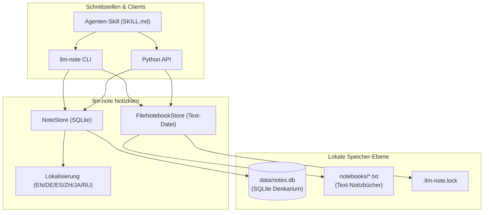

# llm-note

[](https://github.com/doc-bricks/llm-note/actions/workflows/ci.yml)
[](LICENSE)
[](pyproject.toml)
[](tests/)

> [!NOTE]
> **Datenschutz & Lokal-Zuerst**: `llm-note` arbeitet vollständig auf lokalen SQLite-Datenbanken und einfachen Textdateien. Es benötigt keine API-Schlüssel, keine Cloud-Server, keinen Vektordatenbank-Overhead und stellt keinerlei Netzwerkverbindungen her. Ideal für datenschutzkonforme KI-Agenten-Workflows.

**llm-note** ist ein lokaler Notizkern für LLM-Agenten. Das Modul verbindet ein kleines SQLite-Denkarium mit einfachen Text-Notizbüchern, ohne Cloudkonto, ohne Server und ohne externe Laufzeitabhängigkeiten.

## Systemarchitektur



## Einstieg

Nutze llm-note, wenn ein Agent, Coding-Assistent oder lokaler Forschungsworkflow eine kleine, prüfbare Notizschicht braucht:

| Bedarf | llm-note hilft bei |
| --- | --- |
| Agenten-Gedächtnis | Entscheidungen, Beobachtungen und Folge-Marker lokal in SQLite speichern. |
| Notizbuch-Inbox | Textnotizen später prüfen, übertragen oder archivieren. |
| Datenschutz | Ohne gehostete Dienste, Konten, Embeddings oder Hintergrund-Netzwerkzugriffe arbeiten. |
| Skill-Paket | Einen wiederverwendbaren Notiz-Skill neben dem Python-Paket ausliefern. |

## Funktionen

- Strukturierte Notizen, Logbuch-Einträge, Kategorien, Stimmung und Beförderungsmarker speichern.
- Schnelle Text-Notizbücher mit `#NB:`-Transfermarkierungen führen.
- Notizen per Python oder CLI durchsuchen.
- Brainstorm-Einträge anlegen und später in Aufgaben, Wiki-Seiten oder Issues überführen.
- Nutzertexte in sechs Sprachen bündeln: Deutsch, Englisch, Spanisch, vereinfachtes Chinesisch, Japanisch und Russisch.

## Schnellstart

```bash
pip install -e .
llm-note --locale de write "Öffentliche README prüfen" --cat release
llm-note --locale de search README
```

Suchbegriffe werden wörtlich behandelt; `%` und `_` sind keine SQL-Wildcards.
Abfragelimits dürfen zwischen `0` und `1000` liegen. Text-Notizbücher behalten
Unicode-Namen und koordinieren parallele lokale Prozesse über die Datei
`.llm-note.lock` im Notizbuchordner. Offene Transfers erhalten eine
`#LLM-NOTE-ID`, damit ein Retry nach einem Dateifehler den Eintrag nicht
verdoppelt.

## Datenschutz

llm-note sendet selbst keine Daten ins Netz. Datenbanken und Notizordner bleiben lokale Dateien und sind in `.gitignore` ausgeschlossen.

## Einordnung

llm-note ist bewusst kleiner als vollständige Wissensdatenbanken wie Obsidian, Joplin, NotebookLM, Vektordatenbanken oder MCP-Notebook-Server. Es ist ein lokales Python-Paket für Agenten-Notizen, CLI-Notizbücher und reproduzierbare Logbücher, die in Git lesbar bleiben und leicht in andere Tools eingebettet werden können.

Passende Suchphrasen sind `local-first LLM notes`, `SQLite note store for agents`, `agent notebook CLI`, `private AI notebook`, `LLM memory logbook` und `BACH Notizblock extraction`.

## Lizenz

[MIT](LICENSE) - Copyright 2026 Lukas Geiger
