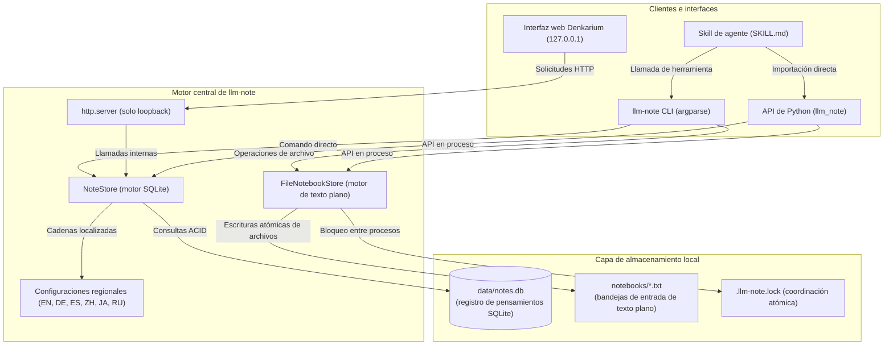
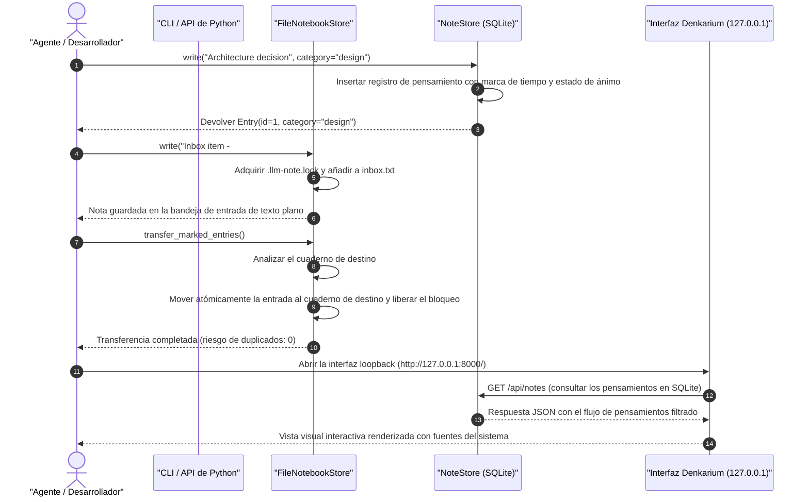

# llm-note

[](https://github.com/doc-bricks/llm-note/actions/workflows/ci.yml)
[](CHANGELOG.md)
[](LICENSE)
[](pyproject.toml)
[](pyproject.toml)
[](tests/)
[](SECURITY.md)
[](SECURITY.md)
[](THIRD_PARTY_LICENSES.md)
[](SECURITY.md)
[-brightgreen.svg)](THIRD_PARTY_LICENSES.md)
[](https://github.com/astral-sh/ruff)
[](https://github.com/doc-bricks)
[](https://github.com/open-bricks)
[](llms.txt)

[English](README.md) · [Deutsch](README_de.md) · [Español](README_es.md) · [简体中文](README_zh-Hans.md) · [日本語](README_ja.md) · [Русский](README_ru.md)
*Traducción asistida por máquina; el README en inglés es la versión de referencia.*

> [!NOTE]
> **Privacidad primero y solo local**: `llm-note` funciona íntegramente con SQLite local y archivos de texto plano. No requiere claves de API, ni servidores en la nube, ni la sobrecarga de una base de datos vectorial, y no realiza ninguna solicitud de red saliente. Ideal para flujos de trabajo de agentes de IA seguros, aislados de la red (air-gapped) y atentos a la privacidad.

---

## Navegación rápida

1. [Visión general y por qué existe](#1-overview--why-this-exists)
2. [Capacidades clave y arquitectura](#2-key-capabilities--architecture)
3. [Arquitectura visual del sistema](#3-visual-system-architecture)
4. [Secuencia del ciclo de vida de notas y transferencias](#4-note--transfer-lifecycle-sequence)
5. [Personas objetivo y descubribilidad](#5-target-personas--discoverability)
6. [Matriz comparativa frente a alternativas](#6-comparative-matrix-vs-alternatives)
7. [Gobernanza e invariantes de ejecución](#7-governance--runtime-invariants)
8. [Guía de la interfaz web local Denkarium](#8-denkarium-local-web-gui-guide)
9. [Referencia completa de la CLI y ejemplos](#9-cli-complete-reference--examples)
10. [Guía de la API de Python y ejemplos de código](#10-python-api-guide--code-examples)
11. [Skill de agente e integración en flujos de trabajo](#11-agent-skill--workflow-integration)
12. [Bandejas de entrada basadas en archivos y semántica de transferencia](#12-file-based-inboxes--transfer-semantics)
13. [Matriz del ecosistema hermano](#13-sibling-ecosystem-matrix)
14. [Licencias de terceros y transparencia](#14-third-party-licenses--transparency)
15. [Política de seguridad y SLA](#15-security-policy--slas)
16. [Verificación y suite de pruebas de contrato](#16-verification--contract-test-suite)
17. [Aviso legal alemán (§ 521 BGB)](#17-german-statutory-notice--521-bgb)
18. [Hoja de ruta y registro de cambios](#18-roadmap--changelog)

---

<a id="1-overview--why-this-exists"></a>
<a id="overview--why-this-exists"></a>
<a id="1-ueberblick--warum-dieses-projekt-existiert"></a>
<a id="ueberblick--warum-dieses-projekt-existiert"></a>
## 1. Visión general y por qué existe

**llm-note** es un motor de cuaderno local ultraligero y sin servicios: sobre todo un cuaderno para personas en el que los asistentes de IA y los agentes de programación escriben para su usuario y, según cómo se use, un cuaderno compartido por ambos.

Los asistentes de IA y los agentes LLM necesitan con frecuencia un lugar donde registrar decisiones, anotar observaciones de contexto y hacer lluvia de ideas para que su usuario pueda leerlas más tarde y, en uso compartido, para que tanto la persona como el agente puedan consultarlas de nuevo. Las soluciones tradicionales exigen bases de datos vectoriales pesadas, suscripciones SaaS alojadas o aplicaciones Electron sobrecargadas que consumen recursos del sistema y filtran telemetría.

### Modos

`llm-note` no impone ningún modo: es el mismo cuaderno sencillo, que se usa de la manera que mejor encaje en cada momento:

- **Para personas, desde LLM** (por defecto): la persona lee; su asistente de IA escribe notas para ella.
- **De personas, para LLM**: la persona deja notas para que su asistente las lea.
- **Espacio de cotrabajo compartido**: la persona y los asistentes de IA escriben en el mismo cuaderno: tus LLM comparten tu espacio.

`llm-note` ofrece el término medio arquitectónico ideal:
- **Cero dependencias externas en tiempo de ejecución**: Construido íntegramente sobre la biblioteca estándar de Python (`sqlite3`, `http.server`, `urllib`, `argparse`, `json`, `pathlib`).
- **Flexibilidad de doble almacén**: Combina entradas de pensamiento estructuradas en SQLite (`data/notes.db`) con bandejas de entrada de texto plano editables por personas (`notebooks/*.txt`).
- **Procedencia de la extracción de BACH**: Desacoplado limpiamente del código del asistente de escritorio BACH (en concreto Notizblock y Denkarium) y liberado como código abierto bajo la licencia permisiva MIT.

---

<a id="2-key-capabilities--architecture"></a>
<a id="key-capabilities--architecture"></a>
<a id="2-kernfaehigkeiten--architektur"></a>
<a id="kernfaehigkeiten--architektur"></a>
## 2. Capacidades clave y arquitectura

- **Registro de pensamientos en SQLite (`NoteStore`)**: Almacena notas estructuradas, entradas de bitácora, categorías, valores de estado de ánimo y marcadores de promoción a tarea con plena fiabilidad ACID.
- **Bandejas de entrada de cuadernos de texto plano (`FileNotebookStore`)**: Gestiona notas portables de texto plano con marcadores de categorización `#NB:` y bloqueo atómico de archivos entre procesos.
- **Interfaz web Denkarium integrada**: Interfaz de navegador de bucle local (loopback), sin instalación, enlazada estrictamente a `127.0.0.1` mediante `http.server` de la biblioteca estándar y fuentes del sistema.
- **Traducción multilingüe**: Localización nativa de mensajes en 6 idiomas: inglés, alemán, español, chino simplificado, japonés y ruso.
- **Skill de agente listo para usar**: El archivo incluido `skills/llm-note/SKILL.md` está listo para que los agentes autónomos lo descubran e invoquen de inmediato.
- **Búsqueda determinista**: Búsquedas de subcadenas literales sin sorpresas por comodines, con límites estrictos de consulta (`0` a `1000`).

---

<a id="3-visual-system-architecture"></a>
<a id="visual-system-architecture"></a>
<a id="3-visuelle-systemarchitektur"></a>
<a id="visuelle-systemarchitektur"></a>
## 3. Arquitectura visual del sistema



---

<a id="4-note--transfer-lifecycle-sequence"></a>
<a id="note--transfer-lifecycle-sequence"></a>
<a id="4-sequenzdiagramm-notiz--und-transfer-lebenszyklus"></a>
<a id="sequenzdiagramm-notiz--und-transfer-lebenszyklus"></a>
## 4. Secuencia del ciclo de vida de notas y transferencias



---

<a id="5-target-personas--discoverability"></a>
<a id="target-personas--discoverability"></a>
<a id="5-zielgruppen--suchbegriffe"></a>
<a id="zielgruppen--suchbegriffe"></a>
## 5. Personas objetivo y descubribilidad

`llm-note` está pensado para cuatro personas y flujos de trabajo específicos:

| ID de persona | Persona objetivo | Necesidad principal | Valor clave aportado |
| :--- | :--- | :--- | :--- |
| `[PERSONA-01]` | **Creadores de agentes autónomos** | Memoria ligera de pensamientos que sobreviva a los reinicios de contexto del LLM | Almacén SQLite sin dependencias, integrable al instante |
| `[PERSONA-02]` | **Desarrolladores atentos a la privacidad** | Toma de notas y bandejas de entrada aisladas de la red y sin salida de datos | Funcionamiento 100 % local sin telemetría ni llamadas de red |
| `[PERSONA-03]` | **Usuarios de asistentes de IA de escritorio** | Navegador visual instantáneo de pensamientos sin Node/Electron | Interfaz Denkarium integrada en loopback (`127.0.0.1`) |
| `[PERSONA-04]` | **Investigadores de ciencia abierta** | Registros de pensamientos y experimentos auditables y rastreables con Git | Bandejas de entrada de texto plano y bases de datos SQLite estándar de un solo archivo |

### Consultas de búsqueda de alta intención

- **Inglés**: `local-first LLM notes`, `SQLite note store for agents`, `agent notebook CLI`, `private AI notebook`, `zero-dependency agent memory python`, `Denkarium agent thought browser`.
- **Alemán**: `lokaler KI Agenten Notizspeicher`, `autonomes Agenten Gedächtnis ohne Cloud`, `datenschutzkonformer Notizblock offline`, `Agenten Denkarium Browser UI`.

---

<a id="6-comparative-matrix-vs-alternatives"></a>
<a id="comparative-matrix-vs-alternatives"></a>
<a id="6-vergleichsmatrix-gegenueber-alternativen"></a>
<a id="vergleichsmatrix-gegenueber-alternativen"></a>
## 6. Matriz comparativa frente a alternativas

| Dimensión arquitectónica | `llm-note` | Obsidian | Joplin | Bases de datos vectoriales | CLI de SQLite pura |
| :--- | :---: | :---: | :---: | :---: | :---: |
| **1. Motor de almacenamiento** | **SQLite + TXT** | Archivos Markdown | SQLite / sincronización | Embeddings vectoriales | Un único archivo SQLite |
| **2. Dependencias en tiempo de ejecución** | **0 (solo stdlib)** | Electron / Node | Electron / BD | C++ / Py pesados | 0 (binario C) |
| **3. Salida de red** | **Cero / aislado de la red** | Los plugins pueden filtrar datos | Servicio de sincronización | API remota / en la nube | Cero / local |
| **4. API de Python para agentes** | **Nativa de primera clase** | REST de la comunidad | API de la comunidad | Cliente complejo | Requiere SQL puro |
| **5. Interfaz web integrada** | **Integrada (127.0.0.1)** | Aplicación de escritorio | Aplicación de escritorio | SaaS aparte | Ninguna |
| **6. Sincronización de bandeja de texto plano** | **Integrada (`#NB:`)** | Carpetas manuales | Importaciones manuales | N/D | Scripts manuales |
| **7. Motor multilingüe** | **6 configuraciones regionales incluidas** | Paquete de la comunidad | Paquete de la comunidad | Centrado en inglés | Solo inglés |
| **8. Privilegio de ejecución** | **RunAsInvoker** | Usuario / escritorio | Usuario / escritorio | Docker / nube | Usuario |
| **9. Empaquetado como skill de agente** | **SKILL.md incluido** | De terceros | De terceros | Código a medida | Ninguno |
| **10. SLA de respuesta de seguridad** | **48 h / 5 d formal** | Comunidad | Comunidad | Solo empresarial | Dominio público |

---

<a id="7-governance--runtime-invariants"></a>
<a id="governance--runtime-invariants"></a>
<a id="7-governance--laufzeit-invarianten"></a>
<a id="governance--laufzeit-invarianten"></a>
## 7. Gobernanza e invariantes de ejecución

El motor `llm-note` opera bajo diez invariantes arquitectónicos inmutables:

- `INV-LOCAL-01`: **100 % local primero y cero salida de datos**: sin solicitudes de red salientes, sin telemetría, sin sincronización en la nube.
- `INV-LOCAL-02`: **Almacenamiento SQLite en un solo archivo**: base de datos ACID estructurada (`data/notes.db`) con diseños de tabla deterministas.
- `INV-LOCAL-03`: **Bandejas de entrada de cuadernos de texto plano**: bandejas de texto legibles por personas (`notebooks/*.txt`) con categorización `#NB:`.
- `INV-LOCAL-04`: **Solo biblioteca estándar**: cero dependencias de terceros en tiempo de ejecución; funciona en cualquier entorno estándar de Python 3.10+.
- `INV-LOCAL-05`: **Transferencias atómicas a prueba de fallos**: bloqueo entre procesos mediante `.llm-note.lock` y marcadores de idempotencia `#LLM-NOTE-ID`.
- `INV-LOCAL-06`: **Interfaz web enlazada a loopback**: Denkarium escucha estrictamente en `127.0.0.1`; admite `--no-browser`.
- `INV-LOCAL-07`: **I18N multilingüe**: 6 catálogos de localización incluidos: EN, DE, ES, ZH, JA, RU.
- `INV-LOCAL-08`: **Sin elevación (RunAsInvoker)**: opera íntegramente en el espacio de usuario sin privilegios; cero elevación administrativa.
- `INV-LOCAL-09`: **Empaquetado como skill de agente**: incluye una skill de agente completa (`skills/llm-note/SKILL.md`) para flujos de trabajo con LLM.
- `INV-LOCAL-10`: **SLA de seguridad de 48 horas**: compromisos formales de respuesta ante vulnerabilidades regulados por `SECURITY.md`.

---

<a id="8-denkarium-local-web-gui-guide"></a>
<a id="denkarium-local-web-gui-guide"></a>
<a id="8-lokale-denkarium-weboberflaeche"></a>
<a id="lokale-denkarium-weboberflaeche"></a>
## 8. Guía de la interfaz web local Denkarium

La interfaz Denkarium ofrece un panel visual de pensamientos instantáneo y sin instalación:

```bash
# Iniciar Denkarium con la configuración por defecto (abre http://127.0.0.1:8000/)
llm-note gui

# Indicar puerto, base de datos y configuración regional alemana personalizados
llm-note --db data/notes.db --locale de gui --port 8765

# Modo headless para servidores en segundo plano o pruebas automatizadas
llm-note gui --port 8765 --no-browser
```

### Aspectos arquitectónicos destacados de la interfaz
- **Sin lastre de frameworks**: HTML/CSS/JavaScript puro (vanilla) servido directamente mediante el `http.server` estándar de Python.
- **Diseño adaptable**: Pensado tanto para pantallas de escritorio como móviles, con fuentes nativas del sistema (`Segoe UI`, `SF Pro`, `system-ui`).
- **Endpoints REST JSON**:
  - `GET /api/notes?search=<query>&category=<cat>&limit=<n>`
  - `POST /api/notes` (crea una nueva entrada de pensamiento)

---

<a id="9-cli-complete-reference--examples"></a>
<a id="cli-complete-reference--examples"></a>
<a id="9-cli-befehlsreferenz--beispiele"></a>
<a id="cli-befehlsreferenz--beispiele"></a>
## 9. Referencia completa de la CLI y ejemplos

### Instalación

`llm-note` todavía no está publicado en PyPI. Instálalo desde el repositorio (Python 3.10+, sin dependencias de terceros en tiempo de ejecución):

```bash
pip install git+https://github.com/doc-bricks/llm-note.git
# o desde un clon local
git clone https://github.com/doc-bricks/llm-note.git && cd llm-note && pip install .
```

Esto proporciona el comando `llm-note` y el paquete de Python `llm_note`.


```bash
# Escribir una nota con categoría y estado de ánimo
llm-note write "Refactor caching layer" --cat dev --mood focused

# Leer notas recientes (límite por defecto: 10)
llm-note read --limit 5

# Buscar notas de forma literal (sin expansión de comodines SQL)
llm-note search "caching"

# Hacer lluvia de ideas para una promoción futura
llm-note brainstorm "Zero-copy serialization options"

# Ver estadísticas resumidas
llm-note stats

# Ejecutar con una base de datos personalizada y configuración regional alemana
llm-note --db custom/notes.db --locale de read --limit 3
```

---

<a id="10-python-api-guide--code-examples"></a>
<a id="python-api-guide--code-examples"></a>
<a id="10-python-api--programmierbeispiele"></a>
<a id="python-api--programmierbeispiele"></a>
## 10. Guía de la API de Python y ejemplos de código

```python
from llm_note import NoteStore, FileNotebookStore

# 1. Inicializar el NoteStore de SQLite
notes = NoteStore("data/notes.db")

# 2. Escribir una entrada de pensamiento estructurada
entry = notes.write(
    content="Implement deterministic seed for test suite",
    category="testing",
    mood="neutral"
)
print(f"Created entry #{entry.id} at {entry.created_at}")

# 3. Buscar notas
matches = notes.search("deterministic")
for match in matches:
    print(f"Found: {match.content} [{match.category}]")

# 4. Promover un pensamiento a tarea
notes.promote(entry.id, target="task")

# 5. Coordinar cuadernos de texto plano
notebooks = FileNotebookStore("notebooks")
notebooks.write("Draft release announcement\n#NB: Marketing")
transferred = notebooks.transfer_marked_entries()
print(f"Transferred {transferred} entries to topic notebooks.")
```

---

<a id="11-agent-skill--workflow-integration"></a>
<a id="agent-skill--workflow-integration"></a>
<a id="11-agenten-skill--workflow-integration"></a>
<a id="agenten-skill--workflow-integration"></a>
## 11. Skill de agente e integración en flujos de trabajo

`llm-note` incluye una definición de skill de agente en [`skills/llm-note/SKILL.md`](skills/llm-note/SKILL.md). Los agentes autónomos (como Claude Code, Antigravity o Codex) pueden invocar `llm-note` directamente para registrar observaciones persistentes, mantener borradores entre delegaciones a subagentes y conservar registros de auditoría.

```markdown
# Ejemplo de invocación de herramienta por un agente
Para guardar una observación de investigación provisional:
`llm-note write "Identified 3 edge cases in token parsing" --cat research`
```

---

<a id="12-file-based-inboxes--transfer-semantics"></a>
<a id="file-based-inboxes--transfer-semantics"></a>
<a id="12-text-notizbuecher--transfer-semantik"></a>
<a id="text-notizbuecher--transfer-semantik"></a>
## 12. Bandejas de entrada basadas en archivos y semántica de transferencia

- **Bandeja de entrada por defecto**: Las entradas sin marcadores se escriben en `notebooks/inbox.txt`.
- **Dirección por tema**: Añade `#NB: <Topic Name>` para dirigir una entrada a `notebooks/<Topic Name>.txt`.
- **Transferencia atómica**: Al llamar a `transfer_marked_entries()` se extraen todas las entradas marcadas, se les asigna un marcador idempotente `#LLM-NOTE-ID: <hash>`, se añaden al archivo del tema de destino y se reescribe el archivo de origen de forma atómica.
- **Seguridad frente a la concurrencia**: La contención entre varios procesos se evita mediante un archivo consultivo `.llm-note.lock` en el directorio del cuaderno.

---

<a id="13-sibling-ecosystem-matrix"></a>
<a id="sibling-ecosystem-matrix"></a>
<a id="13-oekosystem-matrix--verwandte-module"></a>
<a id="oekosystem-matrix--verwandte-module"></a>
## 13. Matriz del ecosistema hermano

`llm-note` forma parte de la familia `doc-bricks` bajo el paraguas de código abierto `open-bricks`:

| Proyecto | Enfoque y papel en el ecosistema | Enlace |
| :--- | :--- | :--- |
| **doc-bricks/llm-note** | Núcleo local-first de pensamientos y cuadernos para agentes | [doc-bricks/llm-note](https://github.com/doc-bricks/llm-note) |
| **doc-bricks/MediaBrain** | Análisis de activos multimodales, OCR y transcripción de documentos | [doc-bricks/MediaBrain](https://github.com/doc-bricks/MediaBrain) |
| **doc-bricks/MailProcessor** | Análisis determinista de correo electrónico y canalización de archivado conforme | [doc-bricks/MailProcessor](https://github.com/doc-bricks/MailProcessor) |
| **file-bricks/ProSync** | Sincronización de directorios robusta y multiplataforma | [file-bricks/ProSync](https://github.com/file-bricks/ProSync) |
| **file-bricks/CloudLockFixer**| Resolución de conflictos y gestor de bloqueos para carpetas en la nube | [file-bricks/CloudLockFixer](https://github.com/file-bricks/CloudLockFixer) |
| **open-bricks/open-bricks** | Catálogo general y herramientas abiertas fundamentales para desarrolladores | [open-bricks/open-bricks](https://github.com/open-bricks) |

---

<a id="14-third-party-licenses--transparency"></a>
<a id="third-party-licenses--transparency"></a>
<a id="14-drittanbieter-lizenzen--transparenz"></a>
<a id="drittanbieter-lizenzen--transparenz"></a>
## 14. Licencias de terceros y transparencia

`llm-note` tiene **0 dependencias externas en tiempo de ejecución**. Todas las operaciones centrales se apoyan exclusivamente en la biblioteca estándar de Python, bajo la [Python Software Foundation License](https://docs.python.org/3/license.html).

- Auditoría completa de SBOM y transparencia de licencias: [`THIRD_PARTY_LICENSES.md`](THIRD_PARTY_LICENSES.md)
- Verificación de cero copyleft: 100 % libre de código GPL, AGPL, LGPL y SSPL.
- Ejecución sin privilegios: Certificado para el espacio de usuario `RunAsInvoker`.

---

<a id="15-security-policy--slas"></a>
<a id="security-policy--slas"></a>
<a id="15-sicherheitsrichtlinie--slas"></a>
<a id="sicherheitsrichtlinie--slas"></a>
## 15. Política de seguridad y SLA

Mantenemos un proceso riguroso y formal de gestión de vulnerabilidades, documentado en [`SECURITY.md`](SECURITY.md):

- **Contrato de cero salida de datos**: El software no realiza ninguna llamada de red. Cualquier salida no autorizada se clasifica como defecto crítico.
- **SLA de respuesta de 48 horas**: Triaje inicial en 48 horas; plan de resolución en 5 días hábiles.
- **Contacto**: Informa de posibles problemas de seguridad de forma confidencial a `security@lukasgeiger.com`.

---

<a id="16-verification--contract-test-suite"></a>
<a id="verification--contract-test-suite"></a>
<a id="16-verifikation--test-suite"></a>
<a id="verifikation--test-suite"></a>
## 16. Verificación y suite de pruebas de contrato

Ejecuta localmente la suite de verificación completa:

```bash
# Ejecutar las pruebas unitarias y de contrato
python -m pytest -ra -v

# Ejecutar el linter rápido Ruff
ruff check .

# Verificar la compilación a bytecode
python -m compileall -q .
```

---

<a id="17-german-statutory-notice--521-bgb"></a>
<a id="german-statutory-notice--521-bgb"></a>
<a id="17-gesetzlicher-haftungshinweis--521-bgb"></a>
<a id="gesetzlicher-haftungshinweis--521-bgb"></a>
## 17. Aviso legal alemán (§ 521 BGB)

Dieses Open-Source-Projekt wird unentgeltlich zur Verfügung gestellt. Für unentgeltliche Bereitstellungen gilt gemäß § 521 BGB das gesetzliche Gefälligkeitsrecht: Die Haftung des Anbieters beschränkt sich auf Vorsatz und grobe Fahrlässigkeit.

Este software de código abierto se proporciona de forma gratuita bajo la licencia MIT. De conformidad con el § 521 del Código Civil alemán (BGB), la responsabilidad legal por las cesiones gratuitas se limita al dolo y a la negligencia grave.

---

<a id="18-roadmap--changelog"></a>
<a id="roadmap--changelog"></a>
<a id="18-roadmap--aenderungsprotokoll"></a>
<a id="roadmap--aenderungsprotokoll"></a>
## 18. Hoja de ruta y registro de cambios

- **Registro de cambios**: Consulta el historial detallado de versiones en [`CHANGELOG.md`](CHANGELOG.md).
- **Hoja de ruta y tareas**: Revisa los hitos actuales y los elementos pendientes del backlog en [`TODO.md`](TODO.md).
- **Índice de contexto para IA**: El índice completo de descubrimiento para LLM está disponible en [`llms.txt`](llms.txt).

---

## Licencia

[MIT](LICENSE) - Copyright (c) 2026 Lukas Geiger.
