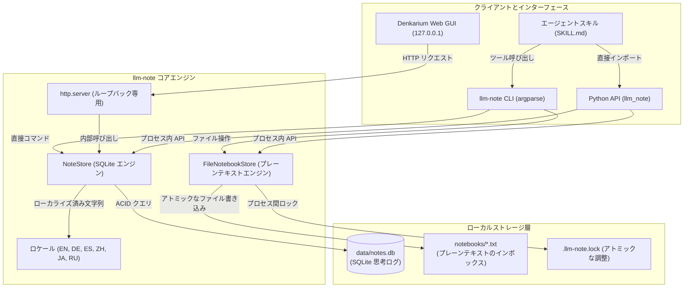
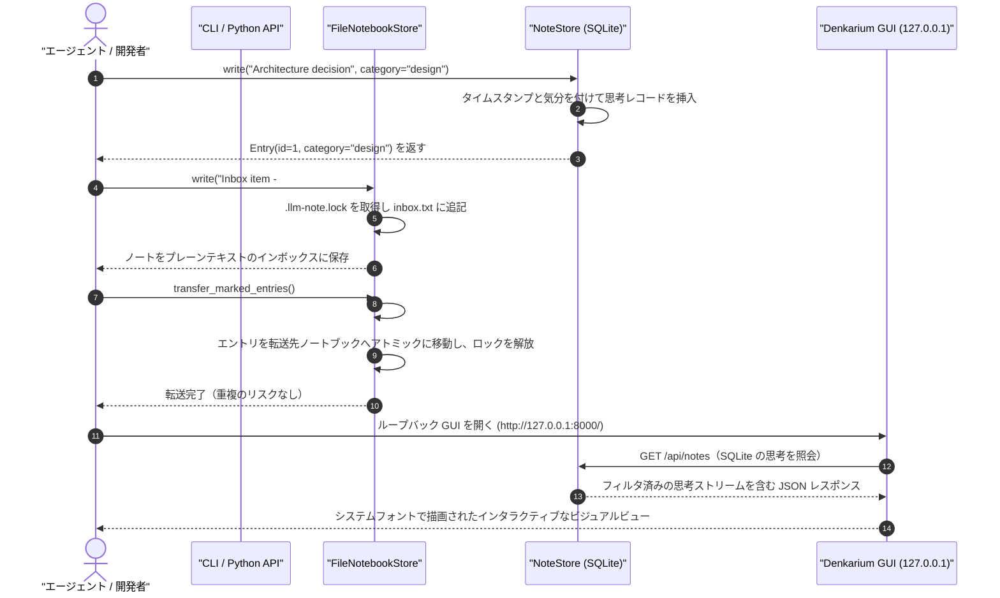

# llm-note

[](https://github.com/doc-bricks/llm-note/actions/workflows/ci.yml)
[](CHANGELOG.md)
[](LICENSE)
[](pyproject.toml)
[](pyproject.toml)
[](tests/)
[](SECURITY.md)
[](SECURITY.md)
[](THIRD_PARTY_LICENSES.md)
[](SECURITY.md)
[-brightgreen.svg)](THIRD_PARTY_LICENSES.md)
[](https://github.com/astral-sh/ruff)
[](https://github.com/doc-bricks)
[](https://github.com/open-bricks)
[](llms.txt)

[English](README.md) · [Deutsch](README_de.md) · [Español](README_es.md) · [简体中文](README_zh-Hans.md) · [日本語](README_ja.md) · [Русский](README_ru.md)

*機械支援による翻訳です。正式な内容は英語版 README が優先されます。*

> [!NOTE]
> **プライバシー最優先・ローカル専用**: `llm-note` は、ローカルの SQLite とプレーンテキストファイルだけで動作します。API キー、クラウドサーバー、ベクトルデータベースのオーバーヘッドは一切不要で、外部へのネットワークリクエストも行いません。安全で、エアギャップ環境にも対応し、プライバシーを重視する AI エージェントのワークフローに最適です。

---

## クイックナビゲーション

1. [概要とこのプロジェクトが存在する理由](#1-overview--why-this-exists)
2. [主な機能とアーキテクチャ](#2-key-capabilities--architecture)
3. [システムアーキテクチャ図](#3-visual-system-architecture)
4. [ノートと転送のライフサイクルシーケンス](#4-note--transfer-lifecycle-sequence)
5. [対象ペルソナと発見しやすさ](#5-target-personas--discoverability)
6. [代替手段との比較マトリクス](#6-comparative-matrix-vs-alternatives)
7. [ガバナンスとランタイム不変条件](#7-governance--runtime-invariants)
8. [Denkarium ローカル Web GUI ガイド](#8-denkarium-local-web-gui-guide)
9. [CLI 完全リファレンスと例](#9-cli-complete-reference--examples)
10. [Python API ガイドとコード例](#10-python-api-guide--code-examples)
11. [エージェントスキルとワークフロー連携](#11-agent-skill--workflow-integration)
12. [ファイルベースのインボックスと転送セマンティクス](#12-file-based-inboxes--transfer-semantics)
13. [兄弟エコシステムマトリクス](#13-sibling-ecosystem-matrix)
14. [サードパーティライセンスと透明性](#14-third-party-licenses--transparency)
15. [セキュリティポリシーと SLA](#15-security-policy--slas)
16. [検証とコントラクトテストスイート](#16-verification--contract-test-suite)
17. [ドイツ法に基づく通知 (§ 521 BGB)](#17-german-statutory-notice--521-bgb)
18. [ロードマップと変更履歴](#18-roadmap--changelog)

---

<a id="1-overview--why-this-exists"></a>
<a id="overview--why-this-exists"></a>
<a id="1-ueberblick--warum-dieses-projekt-existiert"></a>
<a id="ueberblick--warum-dieses-projekt-existiert"></a>
## 1. 概要とこのプロジェクトが存在する理由

**llm-note** は、超軽量でサービス不要のローカルノートブックエンジンです。主として、AI アシスタントやコーディングエージェントがユーザーのために書き込む「人間のためのノートブック」であり、使い方次第では、人間とエージェントの双方が共有するノートブックにもなります。

AI アシスタントや LLM エージェントは、決定事項を記録し、コンテキストに関する所見を残し、アイデアをブレインストーミングして、後でユーザーが読めるようにする場所をたびたび必要とします。共有利用では、人間とエージェントの双方が後から参照できる場所でもあります。従来のソリューションは、重量級のベクトルデータベース、ホスト型の SaaS サブスクリプション、あるいはシステムリソースを消費しテレメトリを漏らす肥大化した Electron アプリケーションを必要とします。

### モード

`llm-note` は特定のモードを強制しません。その時々に合った使い方ができる、同じ一冊のシンプルなノートブックです。

- **LLM から人間へ**（デフォルト）: 人間が読み、AI アシスタントがその人のためにノートを書きます。
- **人間から LLM へ**: 人間がアシスタントに読ませるためのノートを残します。
- **共有コワークスペース**: 人間と AI アシスタントが同じノートブックに書き込みます。あなたの LLM があなたのスペースを共有します。

`llm-note` は、理想的なアーキテクチャ上の中間点を提供します。
- **外部ランタイム依存ゼロ**: Python 標準ライブラリ (`sqlite3`、`http.server`、`urllib`、`argparse`、`json`、`pathlib`) のみで構築されています。
- **デュアルストアの柔軟性**: 構造化された SQLite の思考エントリ (`data/notes.db`) と、人間が編集可能なプレーンテキストのインボックス (`notebooks/*.txt`) を組み合わせています。
- **BACH 由来の出自**: BACH デスクトップアシスタントのコードベース（具体的には Notizblock と Denkarium）から明確に切り離され、寛容な MIT ライセンスの下でオープンソース化されています。

---

<a id="2-key-capabilities--architecture"></a>
<a id="key-capabilities--architecture"></a>
<a id="2-kernfaehigkeiten--architektur"></a>
<a id="kernfaehigkeiten--architektur"></a>
## 2. 主な機能とアーキテクチャ

- **SQLite 思考ログ (`NoteStore`)**: 構造化されたノート、ログブックのエントリ、カテゴリ、気分の値、タスク昇格マーカーを、完全な ACID の信頼性で保存します。
- **プレーンテキストのノートブックインボックス (`FileNotebookStore`)**: `#NB:` による分類マーカーとアトミックなプロセス間ファイルロックを備えた、可搬性のあるプレーンテキストのノートを管理します。
- **組み込み Denkarium Web UI**: インストール不要のループバック専用ブラウザインターフェース。標準ライブラリの `http.server` とシステムフォントを使用し、厳密に `127.0.0.1` にのみバインドされます。
- **多言語ローカライズ**: 英語、ドイツ語、スペイン語、簡体字中国語、日本語、ロシア語の 6 言語でメッセージをネイティブにローカライズします。
- **すぐに使えるエージェントスキル**: 同梱の `skills/llm-note/SKILL.md` により、自律型エージェントがすぐに発見・呼び出しできます。
- **決定論的な検索**: ワイルドカードによる予期せぬ挙動のない文字列そのままの部分一致検索で、クエリの上限は厳密に定められています (`0` ～ `1000`)。

---

<a id="3-visual-system-architecture"></a>
<a id="visual-system-architecture"></a>
<a id="3-visuelle-systemarchitektur"></a>
<a id="visuelle-systemarchitektur"></a>
## 3. システムアーキテクチャ図



---

<a id="4-note--transfer-lifecycle-sequence"></a>
<a id="note--transfer-lifecycle-sequence"></a>
<a id="4-sequenzdiagramm-notiz--und-transfer-lebenszyklus"></a>
<a id="sequenzdiagramm-notiz--und-transfer-lebenszyklus"></a>
## 4. ノートと転送のライフサイクルシーケンス



---

<a id="5-target-personas--discoverability"></a>
<a id="target-personas--discoverability"></a>
<a id="5-zielgruppen--suchbegriffe"></a>
<a id="zielgruppen--suchbegriffe"></a>
## 5. 対象ペルソナと発見しやすさ

`llm-note` は、次の 4 つの具体的なペルソナとワークフロー向けに設計されています。

| ペルソナ ID | 対象ペルソナ | 中心的なニーズ | 提供する主な価値 |
| :--- | :--- | :--- | :--- |
| `[PERSONA-01]` | **自律型エージェントの開発者** | LLM のコンテキストリセットをまたぐ軽量な思考メモリ | すぐに組み込める、依存ゼロの SQLite ストア |
| `[PERSONA-02]` | **プライバシーを重視する開発者** | エアギャップ環境で外部送信ゼロのノート取りとインボックス | テレメトリもネットワーク呼び出しもない 100% ローカル動作 |
| `[PERSONA-03]` | **デスクトップ AI アシスタントのユーザー** | Node/Electron なしで使える即時のビジュアル思考ブラウザ | 組み込みのループバック Denkarium GUI (`127.0.0.1`) |
| `[PERSONA-04]` | **オープンサイエンスの研究者** | Git で追跡でき、監査可能な思考・実験ログ | プレーンテキストのインボックスと標準的な単一ファイルの SQLite データベース |

### 検索意図の高いクエリ

- **英語**: `local-first LLM notes`, `SQLite note store for agents`, `agent notebook CLI`, `private AI notebook`, `zero-dependency agent memory python`, `Denkarium agent thought browser`.
- **ドイツ語**: `lokaler KI Agenten Notizspeicher`, `autonomes Agenten Gedächtnis ohne Cloud`, `datenschutzkonformer Notizblock offline`, `Agenten Denkarium Browser UI`.

---

<a id="6-comparative-matrix-vs-alternatives"></a>
<a id="comparative-matrix-vs-alternatives"></a>
<a id="6-vergleichsmatrix-gegenueber-alternativen"></a>
<a id="vergleichsmatrix-gegenueber-alternativen"></a>
## 6. 代替手段との比較マトリクス

| アーキテクチャ上の観点 | `llm-note` | Obsidian | Joplin | ベクトルデータベース | 素の SQLite CLI |
| :--- | :---: | :---: | :---: | :---: | :---: |
| **1. ストレージエンジン** | **SQLite + TXT** | Markdown ファイル | SQLite / 同期 | ベクトル埋め込み | 単一の SQLite ファイル |
| **2. ランタイム依存** | **0（標準ライブラリのみ）** | Electron / Node | Electron / DB | 重量級の C++ / Py | 0（C バイナリ） |
| **3. ネットワーク外部送信** | **ゼロ / エアギャップ** | プラグインが漏らす可能性あり | 同期サービス | リモート / クラウド API | ゼロ / ローカル |
| **4. エージェント向け Python API** | **ネイティブのファーストクラス** | コミュニティ製 REST | コミュニティ製 API | 複雑なクライアント | 生の SQL が必要 |
| **5. 組み込み Web GUI** | **内蔵 (127.0.0.1)** | デスクトップアプリ | デスクトップアプリ | 別の SaaS | なし |
| **6. プレーンテキストのインボックス同期** | **内蔵 (`#NB:`)** | 手動のフォルダ | 手動のインポート | 該当なし | 手動のスクリプト |
| **7. 多言語エンジン** | **6 ロケール同梱** | コミュニティパック | コミュニティパック | 英語中心 | 英語のみ |
| **8. 実行権限** | **RunAsInvoker** | ユーザー / デスクトップ | ユーザー / デスクトップ | Docker / クラウド | ユーザー |
| **9. エージェントスキルのパッケージ化** | **SKILL.md を同梱** | サードパーティ | サードパーティ | 独自コード | なし |
| **10. セキュリティ対応 SLA** | **48 時間 / 5 日（正式）** | コミュニティ | コミュニティ | エンタープライズ限定 | パブリックドメイン |

---

<a id="7-governance--runtime-invariants"></a>
<a id="governance--runtime-invariants"></a>
<a id="7-governance--laufzeit-invarianten"></a>
<a id="governance--laufzeit-invarianten"></a>
## 7. ガバナンスとランタイム不変条件

`llm-note` エンジンは、変更不可能な 10 のアーキテクチャ不変条件の下で動作します。

- `INV-LOCAL-01`: **100% ローカルファーストかつ外部送信ゼロ** — 外部へのネットワークリクエスト、テレメトリ、クラウド同期は一切ありません。
- `INV-LOCAL-02`: **SQLite 単一ファイルストレージ** — 決定論的なテーブルレイアウトを持つ構造化 ACID データベース (`data/notes.db`)。
- `INV-LOCAL-03`: **プレーンテキストのノートブックインボックス** — `#NB:` による分類を備えた、人間が読めるテキストのインボックス (`notebooks/*.txt`)。
- `INV-LOCAL-04`: **標準ライブラリのみ** — サードパーティのランタイム依存はゼロで、標準的な Python 3.10+ のランタイムであればどこでも動作します。
- `INV-LOCAL-05`: **クラッシュ安全なアトミック転送** — `.llm-note.lock` によるプロセス間ロックと `#LLM-NOTE-ID` の冪等性マーカー。
- `INV-LOCAL-06`: **ループバックにバインドされた Web GUI** — Denkarium は厳密に `127.0.0.1` のみで待ち受けます。`--no-browser` に対応しています。
- `INV-LOCAL-07`: **多言語 I18N** — 6 つのローカライズカタログを同梱: EN、DE、ES、ZH、JA、RU。
- `INV-LOCAL-08`: **RunAsInvoker による非昇格** — 完全に権限のないユーザー空間で動作し、管理者権限への昇格は一切ありません。
- `INV-LOCAL-09`: **エージェントスキルのパッケージ化** — LLM ワークフロー向けに、完全なエージェントスキル (`skills/llm-note/SKILL.md`) を同梱しています。
- `INV-LOCAL-10`: **48 時間セキュリティ SLA** — `SECURITY.md` に定められた、脆弱性対応に関する正式な約束。

---

<a id="8-denkarium-local-web-gui-guide"></a>
<a id="denkarium-local-web-gui-guide"></a>
<a id="8-lokale-denkarium-weboberflaeche"></a>
<a id="lokale-denkarium-weboberflaeche"></a>
## 8. Denkarium ローカル Web GUI ガイド

Denkarium GUI は、インストール不要で即座に使えるビジュアルな思考ダッシュボードを提供します。

```bash
# デフォルト設定で Denkarium を起動（http://127.0.0.1:8000/ を開きます）
llm-note gui

# カスタムポート、データベース、ドイツ語ロケールを指定
llm-note --db data/notes.db --locale de gui --port 8765

# バックグラウンドサーバーや自動テスト向けのヘッドレスモード
llm-note gui --port 8765 --no-browser
```

### GUI アーキテクチャの要点
- **フレームワークの肥大化ゼロ**: 純粋なバニラの HTML/CSS/JavaScript を、Python 標準の `http.server` から直接配信します。
- **レスポンシブレイアウト**: システムネイティブのフォント (`Segoe UI`、`SF Pro`、`system-ui`) を使用し、デスクトップとモバイルの両方のビューポートに対応して設計されています。
- **REST JSON エンドポイント**:
  - `GET /api/notes?search=<query>&category=<cat>&limit=<n>`
  - `POST /api/notes`（新しい思考エントリを作成します）

---

<a id="9-cli-complete-reference--examples"></a>
<a id="cli-complete-reference--examples"></a>
<a id="9-cli-befehlsreferenz--beispiele"></a>
<a id="cli-befehlsreferenz--beispiele"></a>
## 9. CLI 完全リファレンスと例

### インストール

`llm-note` はまだ PyPI で公開されていません。リポジトリからインストールしてください（Python 3.10+、サードパーティのランタイム依存なし）。

```bash
pip install git+https://github.com/doc-bricks/llm-note.git
# またはローカルのクローンから
git clone https://github.com/doc-bricks/llm-note.git && cd llm-note && pip install .
```

これにより、`llm-note` コマンドと `llm_note` Python パッケージが提供されます。


```bash
# カテゴリと気分を付けてノートを書く
llm-note write "Refactor caching layer" --cat dev --mood focused

# 最近のノートを読む（デフォルトの上限は 10）
llm-note read --limit 5

# ノートを文字列そのままで検索する（SQL ワイルドカードの展開なし）
llm-note search "caching"

# 将来の昇格に向けてアイデアをブレインストーミングする
llm-note brainstorm "Zero-copy serialization options"

# 集計統計を表示する
llm-note stats

# カスタムデータベースとドイツ語ロケールで実行する
llm-note --db custom/notes.db --locale de read --limit 3
```

---

<a id="10-python-api-guide--code-examples"></a>
<a id="python-api-guide--code-examples"></a>
<a id="10-python-api--programmierbeispiele"></a>
<a id="python-api--programmierbeispiele"></a>
## 10. Python API ガイドとコード例

```python
from llm_note import NoteStore, FileNotebookStore

# 1. SQLite の NoteStore を初期化する
notes = NoteStore("data/notes.db")

# 2. 構造化された思考エントリを書き込む
entry = notes.write(
    content="Implement deterministic seed for test suite",
    category="testing",
    mood="neutral"
)
print(f"Created entry #{entry.id} at {entry.created_at}")

# 3. ノートを検索する
matches = notes.search("deterministic")
for match in matches:
    print(f"Found: {match.content} [{match.category}]")

# 4. 思考をタスクに昇格させる
notes.promote(entry.id, target="task")

# 5. プレーンテキストのノートブックを連携させる
notebooks = FileNotebookStore("notebooks")
notebooks.write("Draft release announcement\n#NB: Marketing")
transferred = notebooks.transfer_marked_entries()
print(f"Transferred {transferred} entries to topic notebooks.")
```

---

<a id="11-agent-skill--workflow-integration"></a>
<a id="agent-skill--workflow-integration"></a>
<a id="11-agenten-skill--workflow-integration"></a>
<a id="agenten-skill--workflow-integration"></a>
## 11. エージェントスキルとワークフロー連携

`llm-note` には、[`skills/llm-note/SKILL.md`](skills/llm-note/SKILL.md) にエージェントスキル定義が含まれています。自律型エージェント（Claude Code、Antigravity、Codex など）は `llm-note` を直接呼び出して、永続的な所見を記録し、サブエージェントへの委任をまたいでスクラッチパッドを維持し、監査ログを保持できます。

```markdown
# Agent Tool Invocation Example
To save an interim research observation:
`llm-note write "Identified 3 edge cases in token parsing" --cat research`
```

---

<a id="12-file-based-inboxes--transfer-semantics"></a>
<a id="file-based-inboxes--transfer-semantics"></a>
<a id="12-text-notizbuecher--transfer-semantik"></a>
<a id="text-notizbuecher--transfer-semantik"></a>
## 12. ファイルベースのインボックスと転送セマンティクス

- **インボックスのデフォルト**: マーカーのないエントリは `notebooks/inbox.txt` に書き込まれます。
- **トピックの指定**: `#NB: <Topic Name>` を付けると、エントリが `notebooks/<Topic Name>.txt` に振り分けられます。
- **アトミックな転送**: `transfer_marked_entries()` を呼び出すと、マーク付きのエントリがすべて抽出され、冪等な `#LLM-NOTE-ID: <hash>` マーカーが割り当てられ、転送先のトピックファイルに追記されたうえで、転送元ファイルがアトミックに書き換えられます。
- **並行処理の安全性**: ノートブックディレクトリ内のアドバイザリな `.llm-note.lock` ファイルにより、マルチプロセスの競合が防止されます。

---

<a id="13-sibling-ecosystem-matrix"></a>
<a id="sibling-ecosystem-matrix"></a>
<a id="13-oekosystem-matrix--verwandte-module"></a>
<a id="oekosystem-matrix--verwandte-module"></a>
## 13. 兄弟エコシステムマトリクス

`llm-note` は、`open-bricks` オープンソース傘下の `doc-bricks` ファミリーの一員です。

| プロジェクト | エコシステムにおける焦点と役割 | リンク |
| :--- | :--- | :--- |
| **doc-bricks/llm-note** | エージェント向けのローカルファーストな思考・ノートブックのコア | [doc-bricks/llm-note](https://github.com/doc-bricks/llm-note) |
| **doc-bricks/MediaBrain** | マルチモーダルなアセット分析、OCR、ドキュメントの文字起こし | [doc-bricks/MediaBrain](https://github.com/doc-bricks/MediaBrain) |
| **doc-bricks/MailProcessor** | 決定論的なメール解析とコンプライアンスに準拠したアーカイブのパイプライン | [doc-bricks/MailProcessor](https://github.com/doc-bricks/MailProcessor) |
| **file-bricks/ProSync** | 堅牢なクロスプラットフォームのディレクトリ同期 | [file-bricks/ProSync](https://github.com/file-bricks/ProSync) |
| **file-bricks/CloudLockFixer**| クラウドフォルダ向けの競合解決とロックマネージャー | [file-bricks/CloudLockFixer](https://github.com/file-bricks/CloudLockFixer) |
| **open-bricks/open-bricks** | 傘下のカタログと、基盤となるオープンな開発者ツール | [open-bricks/open-bricks](https://github.com/open-bricks) |

---

<a id="14-third-party-licenses--transparency"></a>
<a id="third-party-licenses--transparency"></a>
<a id="14-drittanbieter-lizenzen--transparenz"></a>
<a id="drittanbieter-lizenzen--transparenz"></a>
## 14. サードパーティライセンスと透明性

`llm-note` の外部ランタイム依存は **0** です。すべてのコア処理は、[Python Software Foundation License](https://docs.python.org/3/license.html) の下にある Python 標準ライブラリだけに依存しています。

- SBOM とライセンス透明性の完全な監査: [`THIRD_PARTY_LICENSES.md`](THIRD_PARTY_LICENSES.md)
- コピーレフトゼロの検証: GPL、AGPL、LGPL、SSPL のコードを 100% 含みません。
- 権限のない実行: `RunAsInvoker` のユーザー空間向けに認定されています。

---

<a id="15-security-policy--slas"></a>
<a id="security-policy--slas"></a>
<a id="15-sicherheitsrichtlinie--slas"></a>
<a id="sicherheitsrichtlinie--slas"></a>
## 15. セキュリティポリシーと SLA

[`SECURITY.md`](SECURITY.md) に記載された、厳格で正式な脆弱性管理プロセスを維持しています。

- **外部送信ゼロの契約**: このソフトウェアはネットワーク呼び出しを一切行いません。無許可の外部送信は重大な欠陥として分類されます。
- **48 時間対応 SLA**: 初期トリアージは 48 時間以内、解決計画は 5 営業日以内。
- **連絡先**: セキュリティ上の問題の可能性は、`security@lukasgeiger.com` まで非公開でご報告ください。

---

<a id="16-verification--contract-test-suite"></a>
<a id="verification--contract-test-suite"></a>
<a id="16-verifikation--test-suite"></a>
<a id="verifikation--test-suite"></a>
## 16. 検証とコントラクトテストスイート

完全な検証スイートをローカルで実行します。

```bash
# ユニットテストとコントラクトテストを実行
python -m pytest -ra -v

# 高速な Ruff リンターを実行
ruff check .

# バイトコードのコンパイルを検証
python -m compileall -q .
```

---

<a id="17-german-statutory-notice--521-bgb"></a>
<a id="german-statutory-notice--521-bgb"></a>
<a id="17-gesetzlicher-haftungshinweis--521-bgb"></a>
<a id="gesetzlicher-haftungshinweis--521-bgb"></a>
## 17. ドイツ法に基づく通知 (§ 521 BGB)

Dieses Open-Source-Projekt wird unentgeltlich zur Verfügung gestellt. Für unentgeltliche Bereitstellungen gilt gemäß § 521 BGB das gesetzliche Gefälligkeitsrecht: Die Haftung des Anbieters beschränkt sich auf Vorsatz und grobe Fahrlässigkeit.

このオープンソースソフトウェアは、MIT ライセンスの下で無償で提供されます。ドイツ民法典 (BGB) § 521 に従い、無償提供に関する法定責任は、故意および重過失に限定されます。

---

<a id="18-roadmap--changelog"></a>
<a id="roadmap--changelog"></a>
<a id="18-roadmap--aenderungsprotokoll"></a>
<a id="roadmap--aenderungsprotokoll"></a>
## 18. ロードマップと変更履歴

- **変更履歴**: 詳細なバージョン履歴は [`CHANGELOG.md`](CHANGELOG.md) を参照してください。
- **ロードマップとタスク**: 現在のマイルストーンと未着手のバックログ項目は [`TODO.md`](TODO.md) で確認できます。
- **AI コンテキストインデックス**: LLM 向けの完全な発見用インデックスは [`llms.txt`](llms.txt) で入手できます。

---

## ライセンス

[MIT](LICENSE) - Copyright (c) 2026 Lukas Geiger.
