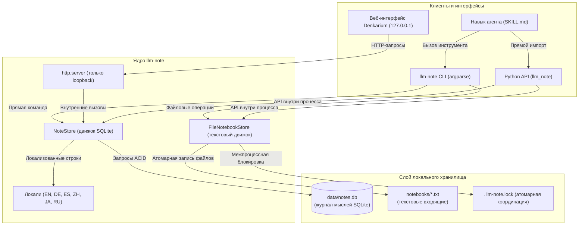
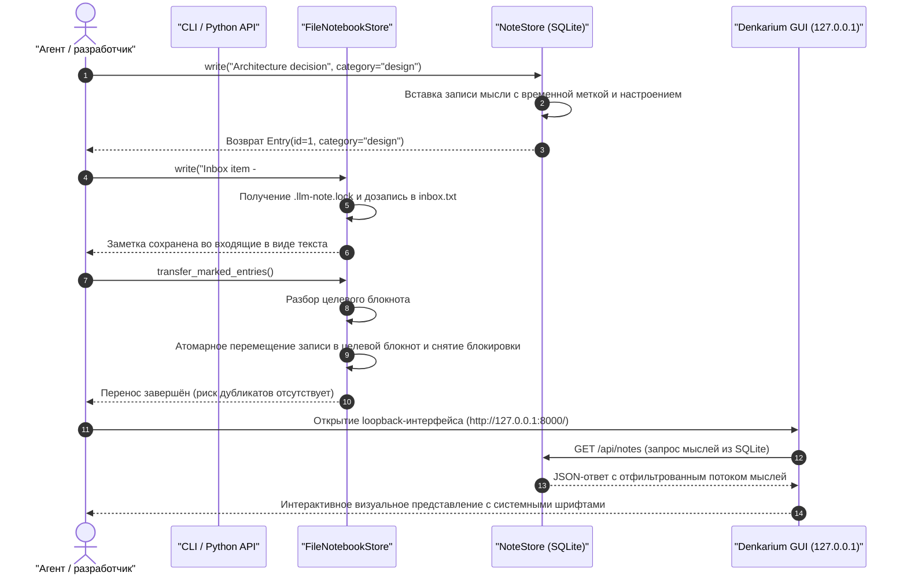

# llm-note

[](https://github.com/doc-bricks/llm-note/actions/workflows/ci.yml)
[](CHANGELOG.md)
[](LICENSE)
[](pyproject.toml)
[](pyproject.toml)
[](tests/)
[](SECURITY.md)
[](SECURITY.md)
[](THIRD_PARTY_LICENSES.md)
[](SECURITY.md)
[-brightgreen.svg)](THIRD_PARTY_LICENSES.md)
[](https://github.com/astral-sh/ruff)
[](https://github.com/doc-bricks)
[](https://github.com/open-bricks)
[](llms.txt)

[English](README.md) · [Deutsch](README_de.md) · [Español](README_es.md) · [简体中文](README_zh-Hans.md) · [日本語](README_ja.md) · [Русский](README_ru.md)

*Перевод выполнен с помощью машинного перевода; приоритетной является английская версия README.*

> [!NOTE]
> **Конфиденциальность прежде всего, только локально**: `llm-note` работает исключительно на локальной SQLite и обычных текстовых файлах. Ему не нужны ключи API, облачные серверы и накладные расходы векторной базы данных, и он не отправляет никаких исходящих сетевых запросов. Идеально подходит для защищённых, изолированных (air-gapped) и ориентированных на приватность рабочих процессов ИИ-агентов.

---

## Быстрая навигация

1. [Обзор и зачем это нужно](#1-overview--why-this-exists)
2. [Ключевые возможности и архитектура](#2-key-capabilities--architecture)
3. [Наглядная архитектура системы](#3-visual-system-architecture)
4. [Последовательность жизненного цикла заметок и переноса](#4-note--transfer-lifecycle-sequence)
5. [Целевые персоны и поиск проекта](#5-target-personas--discoverability)
6. [Сравнительная матрица с альтернативами](#6-comparative-matrix-vs-alternatives)
7. [Управление и инварианты времени выполнения](#7-governance--runtime-invariants)
8. [Руководство по локальному веб-интерфейсу Denkarium](#8-denkarium-local-web-gui-guide)
9. [Полный справочник по CLI и примеры](#9-cli-complete-reference--examples)
10. [Руководство по Python API и примеры кода](#10-python-api-guide--code-examples)
11. [Навык агента и интеграция в рабочие процессы](#11-agent-skill--workflow-integration)
12. [Файловые входящие и семантика переноса](#12-file-based-inboxes--transfer-semantics)
13. [Матрица родственной экосистемы](#13-sibling-ecosystem-matrix)
14. [Лицензии сторонних компонентов и прозрачность](#14-third-party-licenses--transparency)
15. [Политика безопасности и SLA](#15-security-policy--slas)
16. [Проверка и набор контрактных тестов](#16-verification--contract-test-suite)
17. [Уведомление по немецкому законодательству (§ 521 BGB)](#17-german-statutory-notice--521-bgb)
18. [Дорожная карта и журнал изменений](#18-roadmap--changelog)

---

<a id="1-overview--why-this-exists"></a>
<a id="overview--why-this-exists"></a>
<a id="1-ueberblick--warum-dieses-projekt-existiert"></a>
<a id="ueberblick--warum-dieses-projekt-existiert"></a>
## 1. Обзор и зачем это нужно

**llm-note** - это сверхлёгкий локальный движок блокнота, не требующий никаких сервисов. В первую очередь это блокнот для людей, в который ИИ-ассистенты и кодирующие агенты пишут для своего пользователя, а в зависимости от способа использования - блокнот, общий для обоих.

ИИ-ассистентам и LLM-агентам часто нужно место, где можно записывать решения, фиксировать наблюдения о контексте и обдумывать идеи, чтобы пользователь мог прочитать их позже, а при совместном использовании - чтобы и человек, и агент могли к ним возвращаться. Традиционные решения требуют тяжёлых векторных баз данных, платных облачных SaaS-подписок или раздутых Electron-приложений, которые потребляют системные ресурсы и отправляют телеметрию.

### Режимы

`llm-note` не навязывает режим - это один и тот же простой блокнот, который используется так, как подходит в данный момент:

- **Для людей, от LLM** (по умолчанию): человек читает, а его ИИ-ассистент пишет для него заметки.
- **От людей, для LLM**: человек оставляет заметки, которые прочитает его ассистент.
- **Общее рабочее пространство**: человек и ИИ-ассистенты пишут в один и тот же блокнот - ваши LLM делят с вами пространство.

`llm-note` предлагает идеальный архитектурный компромисс:
- **Ноль внешних зависимостей времени выполнения**: построен целиком на стандартной библиотеке Python (`sqlite3`, `http.server`, `urllib`, `argparse`, `json`, `pathlib`).
- **Гибкость двух хранилищ**: сочетает структурированные записи мыслей в SQLite (`data/notes.db`) с редактируемыми человеком текстовыми входящими (`notebooks/*.txt`).
- **Происхождение из BACH**: чисто отделён от кодовой базы настольного ассистента BACH (в частности, от Notizblock и Denkarium) и выпущен как открытое ПО под свободной лицензией MIT.

---

<a id="2-key-capabilities--architecture"></a>
<a id="key-capabilities--architecture"></a>
<a id="2-kernfaehigkeiten--architektur"></a>
<a id="kernfaehigkeiten--architektur"></a>
## 2. Ключевые возможности и архитектура

- **Журнал мыслей в SQLite (`NoteStore`)**: хранит структурированные заметки, записи журнала, категории, значения настроения и маркеры повышения до задачи с полной надёжностью ACID.
- **Текстовые входящие блокнотов (`FileNotebookStore`)**: управляет переносимыми текстовыми заметками с маркерами категорий `#NB:` и атомарной межпроцессной блокировкой файлов.
- **Встроенный веб-интерфейс Denkarium**: не требующий установки браузерный интерфейс, привязанный строго к `127.0.0.1` (loopback), на основе стандартного `http.server` и системных шрифтов.
- **Многоязычная локализация**: встроенная локализация сообщений на 6 языках: английском, немецком, испанском, китайском (упрощённом), японском и русском.
- **Готовый навык агента**: в комплекте `skills/llm-note/SKILL.md` - автономные агенты могут сразу его обнаружить и использовать.
- **Детерминированный поиск**: поиск буквальной подстроки без сюрпризов с подстановочными символами и со строгими ограничениями запроса (от `0` до `1000`).

---

<a id="3-visual-system-architecture"></a>
<a id="visual-system-architecture"></a>
<a id="3-visuelle-systemarchitektur"></a>
<a id="visuelle-systemarchitektur"></a>
## 3. Наглядная архитектура системы



---

<a id="4-note--transfer-lifecycle-sequence"></a>
<a id="note--transfer-lifecycle-sequence"></a>
<a id="4-sequenzdiagramm-notiz--und-transfer-lebenszyklus"></a>
<a id="sequenzdiagramm-notiz--und-transfer-lebenszyklus"></a>
## 4. Последовательность жизненного цикла заметок и переноса



---

<a id="5-target-personas--discoverability"></a>
<a id="target-personas--discoverability"></a>
<a id="5-zielgruppen--suchbegriffe"></a>
<a id="zielgruppen--suchbegriffe"></a>
## 5. Целевые персоны и поиск проекта

`llm-note` рассчитан на четыре конкретные персоны и сценария использования:

| ID персоны | Целевая персона | Основная потребность | Ключевая ценность |
| :--- | :--- | :--- | :--- |
| `[PERSONA-01]` | **Разработчики автономных агентов** | Лёгкая память мыслей между сбросами контекста LLM | Хранилище SQLite без зависимостей, которое мгновенно встраивается |
| `[PERSONA-02]` | **Разработчики, заботящиеся о конфиденциальности** | Заметки и входящие в изолированной среде без исходящего трафика | 100% локальная работа без телеметрии и сетевых вызовов |
| `[PERSONA-03]` | **Пользователи настольных ИИ-ассистентов** | Мгновенный визуальный браузер мыслей без Node/Electron | Встроенный loopback-интерфейс Denkarium (`127.0.0.1`) |
| `[PERSONA-04]` | **Исследователи открытой науки** | Журналы мыслей и экспериментов, отслеживаемые в Git и пригодные для аудита | Текстовые входящие и стандартные однофайловые базы данных SQLite |

### Поисковые запросы с высоким намерением

- **Английский**: `local-first LLM notes`, `SQLite note store for agents`, `agent notebook CLI`, `private AI notebook`, `zero-dependency agent memory python`, `Denkarium agent thought browser`.
- **Немецкий**: `lokaler KI Agenten Notizspeicher`, `autonomes Agenten Gedächtnis ohne Cloud`, `datenschutzkonformer Notizblock offline`, `Agenten Denkarium Browser UI`.

---

<a id="6-comparative-matrix-vs-alternatives"></a>
<a id="comparative-matrix-vs-alternatives"></a>
<a id="6-vergleichsmatrix-gegenueber-alternativen"></a>
<a id="vergleichsmatrix-gegenueber-alternativen"></a>
## 6. Сравнительная матрица с альтернативами

| Архитектурный аспект | `llm-note` | Obsidian | Joplin | Векторные базы данных | «Голый» SQLite CLI |
| :--- | :---: | :---: | :---: | :---: | :---: |
| **1. Движок хранения** | **SQLite + TXT** | Файлы Markdown | SQLite / синхронизация | Векторные эмбеддинги | Один файл SQLite |
| **2. Зависимости времени выполнения** | **0 (только stdlib)** | Electron / Node | Electron / БД | Тяжёлые C++ / Py | 0 (бинарник на C) |
| **3. Исходящий сетевой трафик** | **Нулевой / изолированная среда** | Плагины могут передавать данные | Служба синхронизации | Удалённый / облачный API | Нулевой / локально |
| **4. Python API для агентов** | **Нативный, первоклассный** | REST от сообщества | API от сообщества | Сложный клиент | Требуется чистый SQL |
| **5. Встроенный веб-интерфейс** | **Встроен (127.0.0.1)** | Настольное приложение | Настольное приложение | Отдельный SaaS | Нет |
| **6. Синхронизация текстовых входящих** | **Встроена (`#NB:`)** | Ручные папки | Ручной импорт | Не применимо | Ручные скрипты |
| **7. Многоязычный движок** | **6 встроенных локалей** | Пакет от сообщества | Пакет от сообщества | Ориентирован на английский | Только английский |
| **8. Привилегии выполнения** | **RunAsInvoker** | Пользователь / настольный режим | Пользователь / настольный режим | Docker / облако | Пользователь |
| **9. Упаковка навыка агента** | **SKILL.md в комплекте** | Сторонний | Сторонний | Собственный код | Нет |
| **10. SLA реагирования на уязвимости** | **48 ч / 5 дн., формально** | Сообщество | Сообщество | Только для предприятий | Общественное достояние |

---

<a id="7-governance--runtime-invariants"></a>
<a id="governance--runtime-invariants"></a>
<a id="7-governance--laufzeit-invarianten"></a>
<a id="governance--laufzeit-invarianten"></a>
## 7. Управление и инварианты времени выполнения

Движок `llm-note` работает в соответствии с десятью неизменными архитектурными инвариантами:

- `INV-LOCAL-01`: **100% local-first и нулевой исходящий трафик** — никаких исходящих сетевых запросов, телеметрии и облачной синхронизации.
- `INV-LOCAL-02`: **Однофайловое хранилище SQLite** — структурированная база данных ACID (`data/notes.db`) с детерминированной схемой таблиц.
- `INV-LOCAL-03`: **Текстовые входящие блокнотов** — читаемые человеком текстовые входящие (`notebooks/*.txt`) с категоризацией через `#NB:`.
- `INV-LOCAL-04`: **Только стандартная библиотека** — ноль сторонних зависимостей времени выполнения; работает в любой стандартной среде Python 3.10+.
- `INV-LOCAL-05`: **Атомарные переносы, устойчивые к сбоям** — межпроцессная блокировка через `.llm-note.lock` и маркеры идемпотентности `#LLM-NOTE-ID`.
- `INV-LOCAL-06`: **Веб-интерфейс, привязанный к loopback** — Denkarium слушает строго `127.0.0.1`; поддерживается `--no-browser`.
- `INV-LOCAL-07`: **Многоязычный I18N** — 6 встроенных каталогов локализации: EN, DE, ES, ZH, JA, RU.
- `INV-LOCAL-08`: **RunAsInvoker, без повышения привилегий** — работает целиком в непривилегированном пользовательском пространстве; никакого административного повышения.
- `INV-LOCAL-09`: **Упаковка навыка агента** — поставляется с полным навыком агента (`skills/llm-note/SKILL.md`) для рабочих процессов LLM.
- `INV-LOCAL-10`: **48-часовой SLA по безопасности** — формальные обязательства по реагированию на уязвимости, регулируемые `SECURITY.md`.

---

<a id="8-denkarium-local-web-gui-guide"></a>
<a id="denkarium-local-web-gui-guide"></a>
<a id="8-lokale-denkarium-weboberflaeche"></a>
<a id="lokale-denkarium-weboberflaeche"></a>
## 8. Руководство по локальному веб-интерфейсу Denkarium

Интерфейс Denkarium - это мгновенная визуальная панель мыслей, не требующая установки:

```bash
# Запуск Denkarium с настройками по умолчанию (открывает http://127.0.0.1:8000/)
llm-note gui

# Указание своего порта, базы данных и немецкой локали
llm-note --db data/notes.db --locale de gui --port 8765

# Режим без интерфейса для фоновых серверов или автоматического тестирования
llm-note gui --port 8765 --no-browser
```

### Архитектурные особенности GUI
- **Никакой раздутости фреймворков**: чистые HTML/CSS/JavaScript без фреймворков, раздаваемые напрямую через стандартный `http.server` Python.
- **Адаптивная вёрстка**: рассчитана как на настольные, так и на мобильные окна просмотра, с нативными системными шрифтами (`Segoe UI`, `SF Pro`, `system-ui`).
- **REST JSON-эндпоинты**:
  - `GET /api/notes?search=<query>&category=<cat>&limit=<n>`
  - `POST /api/notes` (создаёт новую запись мысли)

---

<a id="9-cli-complete-reference--examples"></a>
<a id="cli-complete-reference--examples"></a>
<a id="9-cli-befehlsreferenz--beispiele"></a>
<a id="cli-befehlsreferenz--beispiele"></a>
## 9. Полный справочник по CLI и примеры

### Установка

`llm-note` пока не опубликован на PyPI. Установите его из репозитория (Python 3.10+, без сторонних зависимостей времени выполнения):

```bash
pip install git+https://github.com/doc-bricks/llm-note.git
# или из локального клона
git clone https://github.com/doc-bricks/llm-note.git && cd llm-note && pip install .
```

Это устанавливает команду `llm-note` и пакет Python `llm_note`.


```bash
# Написать заметку с категорией и настроением
llm-note write "Refactor caching layer" --cat dev --mood focused

# Прочитать недавние заметки (лимит по умолчанию - 10)
llm-note read --limit 5

# Буквальный поиск по заметкам (без расширения подстановочных символов SQL)
llm-note search "caching"

# Обдумать идеи для будущего повышения
llm-note brainstorm "Zero-copy serialization options"

# Просмотреть сводную статистику
llm-note stats

# Запуск с собственной базой данных и немецкой локалью
llm-note --db custom/notes.db --locale de read --limit 3
```

---

<a id="10-python-api-guide--code-examples"></a>
<a id="python-api-guide--code-examples"></a>
<a id="10-python-api--programmierbeispiele"></a>
<a id="python-api--programmierbeispiele"></a>
## 10. Руководство по Python API и примеры кода

```python
from llm_note import NoteStore, FileNotebookStore

# 1. Инициализация NoteStore на SQLite
notes = NoteStore("data/notes.db")

# 2. Запись структурированной записи мысли
entry = notes.write(
    content="Implement deterministic seed for test suite",
    category="testing",
    mood="neutral"
)
print(f"Created entry #{entry.id} at {entry.created_at}")

# 3. Поиск заметок
matches = notes.search("deterministic")
for match in matches:
    print(f"Found: {match.content} [{match.category}]")

# 4. Повышение мысли до задачи
notes.promote(entry.id, target="task")

# 5. Работа с текстовыми блокнотами
notebooks = FileNotebookStore("notebooks")
notebooks.write("Draft release announcement\n#NB: Marketing")
transferred = notebooks.transfer_marked_entries()
print(f"Transferred {transferred} entries to topic notebooks.")
```

---

<a id="11-agent-skill--workflow-integration"></a>
<a id="agent-skill--workflow-integration"></a>
<a id="11-agenten-skill--workflow-integration"></a>
<a id="agenten-skill--workflow-integration"></a>
## 11. Навык агента и интеграция в рабочие процессы

`llm-note` включает определение навыка агента в [`skills/llm-note/SKILL.md`](skills/llm-note/SKILL.md). Автономные агенты (такие как Claude Code, Antigravity или Codex) могут напрямую вызывать `llm-note`, чтобы записывать устойчивые наблюдения, вести черновые заметки при делегировании субагентам и сохранять журналы аудита.

```markdown
# Agent Tool Invocation Example
To save an interim research observation:
`llm-note write "Identified 3 edge cases in token parsing" --cat research`
```

---

<a id="12-file-based-inboxes--transfer-semantics"></a>
<a id="file-based-inboxes--transfer-semantics"></a>
<a id="12-text-notizbuecher--transfer-semantik"></a>
<a id="text-notizbuecher--transfer-semantik"></a>
## 12. Файловые входящие и семантика переноса

- **Входящие по умолчанию**: записи без маркеров записываются в `notebooks/inbox.txt`.
- **Адресация по теме**: добавьте `#NB: <Topic Name>`, чтобы направить запись в `notebooks/<Topic Name>.txt`.
- **Атомарный перенос**: вызов `transfer_marked_entries()` извлекает все помеченные записи, назначает идемпотентный маркер `#LLM-NOTE-ID: <hash>`, дописывает их в целевой файл темы и атомарно перезаписывает исходный файл.
- **Безопасность при параллельной работе**: конкуренция между несколькими процессами предотвращается консультативным файлом `.llm-note.lock` в каталоге блокнотов.

---

<a id="13-sibling-ecosystem-matrix"></a>
<a id="sibling-ecosystem-matrix"></a>
<a id="13-oekosystem-matrix--verwandte-module"></a>
<a id="oekosystem-matrix--verwandte-module"></a>
## 13. Матрица родственной экосистемы

`llm-note` входит в семейство `doc-bricks` в рамках открытой экосистемы `open-bricks`:

| Проект | Фокус и роль в экосистеме | Ссылка |
| :--- | :--- | :--- |
| **doc-bricks/llm-note** | Local-first ядро мыслей и блокнотов для агентов | [doc-bricks/llm-note](https://github.com/doc-bricks/llm-note) |
| **doc-bricks/MediaBrain** | Мультимодальный анализ ресурсов, OCR и транскрибация документов | [doc-bricks/MediaBrain](https://github.com/doc-bricks/MediaBrain) |
| **doc-bricks/MailProcessor** | Детерминированный разбор электронной почты и конвейер архивирования с соблюдением требований | [doc-bricks/MailProcessor](https://github.com/doc-bricks/MailProcessor) |
| **file-bricks/ProSync** | Надёжная кроссплатформенная синхронизация каталогов | [file-bricks/ProSync](https://github.com/file-bricks/ProSync) |
| **file-bricks/CloudLockFixer**| Разрешение конфликтов и менеджер блокировок для облачных папок | [file-bricks/CloudLockFixer](https://github.com/file-bricks/CloudLockFixer) |
| **open-bricks/open-bricks** | Общий каталог и базовые открытые инструменты разработчика | [open-bricks/open-bricks](https://github.com/open-bricks) |

---

<a id="14-third-party-licenses--transparency"></a>
<a id="third-party-licenses--transparency"></a>
<a id="14-drittanbieter-lizenzen--transparenz"></a>
<a id="drittanbieter-lizenzen--transparenz"></a>
## 14. Лицензии сторонних компонентов и прозрачность

У `llm-note` **0 внешних зависимостей времени выполнения**. Все основные операции опираются исключительно на стандартную библиотеку Python, распространяемую по [лицензии Python Software Foundation](https://docs.python.org/3/license.html).

- Полный аудит SBOM и прозрачности лицензий: [`THIRD_PARTY_LICENSES.md`](THIRD_PARTY_LICENSES.md)
- Проверка отсутствия копилефта: 100% свободно от кода под GPL, AGPL, LGPL и SSPL.
- Выполнение без привилегий: сертифицировано для пользовательского пространства `RunAsInvoker`.

---

<a id="15-security-policy--slas"></a>
<a id="security-policy--slas"></a>
<a id="15-sicherheitsrichtlinie--slas"></a>
<a id="sicherheitsrichtlinie--slas"></a>
## 15. Политика безопасности и SLA

Мы придерживаемся строгого формального процесса управления уязвимостями, описанного в [`SECURITY.md`](SECURITY.md):

- **Контракт нулевого исходящего трафика**: программа не выполняет сетевых вызовов. Любая несанкционированная отправка данных классифицируется как критический дефект.
- **SLA ответа в течение 48 часов**: первичная оценка в течение 48 часов; план решения в течение 5 рабочих дней.
- **Контакт**: о возможных проблемах безопасности сообщайте конфиденциально на `security@lukasgeiger.com`.

---

<a id="16-verification--contract-test-suite"></a>
<a id="verification--contract-test-suite"></a>
<a id="16-verifikation--test-suite"></a>
<a id="verifikation--test-suite"></a>
## 16. Проверка и набор контрактных тестов

Запустите полный набор проверок локально:

```bash
# Запуск модульных и контрактных тестов
python -m pytest -ra -v

# Запуск быстрого линтера Ruff
ruff check .

# Проверка компиляции байт-кода
python -m compileall -q .
```

---

<a id="17-german-statutory-notice--521-bgb"></a>
<a id="german-statutory-notice--521-bgb"></a>
<a id="17-gesetzlicher-haftungshinweis--521-bgb"></a>
<a id="gesetzlicher-haftungshinweis--521-bgb"></a>
## 17. Уведомление по немецкому законодательству (§ 521 BGB)

Dieses Open-Source-Projekt wird unentgeltlich zur Verfügung gestellt. Für unentgeltliche Bereitstellungen gilt gemäß § 521 BGB das gesetzliche Gefälligkeitsrecht: Die Haftung des Anbieters beschränkt sich auf Vorsatz und grobe Fahrlässigkeit.

Это программное обеспечение с открытым исходным кодом предоставляется бесплатно на условиях лицензии MIT. В соответствии с § 521 Гражданского уложения Германии (BGB) установленная законом ответственность при безвозмездном предоставлении ограничивается умыслом и грубой неосторожностью.

---

<a id="18-roadmap--changelog"></a>
<a id="roadmap--changelog"></a>
<a id="18-roadmap--aenderungsprotokoll"></a>
<a id="roadmap--aenderungsprotokoll"></a>
## 18. Дорожная карта и журнал изменений

- **Журнал изменений**: подробная история версий — в [`CHANGELOG.md`](CHANGELOG.md).
- **Дорожная карта и задачи**: текущие вехи и открытые пункты бэклога — в [`TODO.md`](TODO.md).
- **Индекс контекста для ИИ**: полный индекс для обнаружения LLM доступен в [`llms.txt`](llms.txt).

---

## Лицензия

[MIT](LICENSE) - Copyright (c) 2026 Lukas Geiger.
