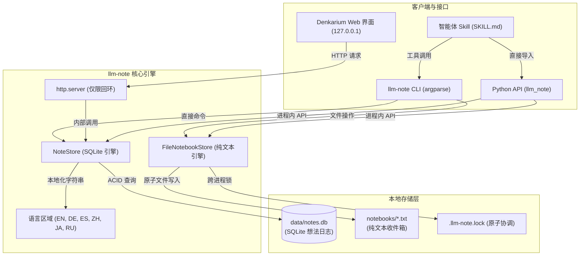
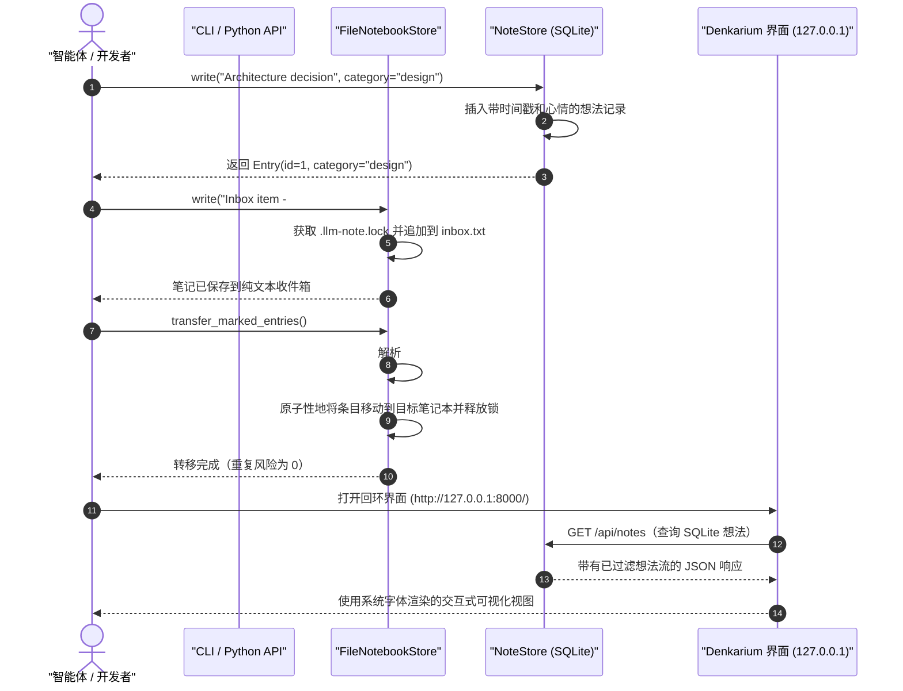

# llm-note

[](https://github.com/doc-bricks/llm-note/actions/workflows/ci.yml)
[](CHANGELOG.md)
[](LICENSE)
[](pyproject.toml)
[](pyproject.toml)
[](tests/)
[](SECURITY.md)
[](SECURITY.md)
[](THIRD_PARTY_LICENSES.md)
[](SECURITY.md)
[-brightgreen.svg)](THIRD_PARTY_LICENSES.md)
[](https://github.com/astral-sh/ruff)
[](https://github.com/doc-bricks)
[](https://github.com/open-bricks)
[](llms.txt)

[English](README.md) · [Deutsch](README_de.md) · [Español](README_es.md) · [简体中文](README_zh-Hans.md) · [日本語](README_ja.md) · [Русский](README_ru.md)
*机器辅助翻译；以英文 README 为准。*

> [!NOTE]
> **隐私优先，仅限本地**：`llm-note` 完全基于本地 SQLite 和纯文本文件运行。它不需要 API 密钥、云服务器或向量数据库的额外开销，也不会发起任何出站网络请求。非常适合安全、物理隔离（air-gapped）且注重隐私的 AI 智能体工作流。

---

## 快速导航

1. [概述与存在意义](#1-overview--why-this-exists)
2. [核心能力与架构](#2-key-capabilities--architecture)
3. [系统架构图](#3-visual-system-architecture)
4. [笔记与转移生命周期时序](#4-note--transfer-lifecycle-sequence)
5. [目标用户画像与可发现性](#5-target-personas--discoverability)
6. [与替代方案的对比矩阵](#6-comparative-matrix-vs-alternatives)
7. [治理与运行时不变量](#7-governance--runtime-invariants)
8. [Denkarium 本地 Web 界面指南](#8-denkarium-local-web-gui-guide)
9. [CLI 完整参考与示例](#9-cli-complete-reference--examples)
10. [Python API 指南与代码示例](#10-python-api-guide--code-examples)
11. [智能体 Skill 与工作流集成](#11-agent-skill--workflow-integration)
12. [基于文件的收件箱与转移语义](#12-file-based-inboxes--transfer-semantics)
13. [同类生态系统矩阵](#13-sibling-ecosystem-matrix)
14. [第三方许可证与透明度](#14-third-party-licenses--transparency)
15. [安全策略与 SLA](#15-security-policy--slas)
16. [验证与契约测试套件](#16-verification--contract-test-suite)
17. [德国法定声明（§ 521 BGB）](#17-german-statutory-notice--521-bgb)
18. [路线图与变更日志](#18-roadmap--changelog)

---

<a id="1-overview--why-this-exists"></a>
<a id="overview--why-this-exists"></a>
<a id="1-ueberblick--warum-dieses-projekt-existiert"></a>
<a id="ueberblick--warum-dieses-projekt-existiert"></a>
## 1. 概述与存在意义

**llm-note** 是一个超轻量、无需任何服务的本地笔记本引擎——它首先是一个供人阅读的笔记本，由 AI 助手和编程智能体为其用户写入内容；视使用方式而定，也可以是人与智能体共同使用的笔记本。

AI 助手和 LLM 智能体经常需要一个地方来记录决策、捕捉上下文观察和进行头脑风暴，以便用户日后阅读；在共享使用时，人和智能体都可以回头查阅。传统方案需要笨重的向量数据库、托管的 SaaS 订阅，或者臃肿的 Electron 应用，这些方案会消耗系统资源并泄露遥测数据。

### 模式

`llm-note` 并不强制某种模式——它是同一个朴素的笔记本，可按当下最合适的方式使用：

- **供人阅读，由 LLM 写入**（默认）：人来阅读；其 AI 助手为其撰写笔记。
- **由人写入，供 LLM 阅读**：人为其助手留下笔记，供助手阅读。
- **共享协作空间**：人和 AI 助手写入同一个笔记本——你的 LLM 与你共享空间。

`llm-note` 提供了理想的架构折中方案：
- **零外部运行时依赖**：完全基于 Python 标准库构建（`sqlite3`、`http.server`、`urllib`、`argparse`、`json`、`pathlib`）。
- **双存储灵活性**：将结构化的 SQLite 想法条目（`data/notes.db`）与可由人工编辑的纯文本收件箱（`notebooks/*.txt`）结合在一起。
- **BACH 提取溯源**：与 BACH 桌面助手代码库（特别是 Notizblock 和 Denkarium）干净地解耦，并以宽松的 MIT 许可证开源。

---

<a id="2-key-capabilities--architecture"></a>
<a id="key-capabilities--architecture"></a>
<a id="2-kernfaehigkeiten--architektur"></a>
<a id="kernfaehigkeiten--architektur"></a>
## 2. 核心能力与架构

- **SQLite 想法日志（`NoteStore`）**：以完整的 ACID 可靠性存储结构化笔记、日志条目、类别、心情值以及任务提升标记。
- **纯文本笔记本收件箱（`FileNotebookStore`）**：通过 `#NB:` 分类标记和原子级跨进程文件锁，管理可移植的纯文本笔记。
- **内嵌 Denkarium Web 界面**：免安装的回环（loopback）浏览器界面，使用标准库 `http.server` 和系统字体，严格绑定到 `127.0.0.1`。
- **多语言翻译**：原生支持 6 种语言的消息本地化：英语、德语、西班牙语、简体中文、日语和俄语。
- **开箱即用的智能体 Skill**：内置 `skills/llm-note/SKILL.md`，可供自主智能体立即发现并调用。
- **确定性搜索**：字面子串搜索，无通配符意外，并有严格的查询上限（`0` 到 `1000`）。

---

<a id="3-visual-system-architecture"></a>
<a id="visual-system-architecture"></a>
<a id="3-visuelle-systemarchitektur"></a>
<a id="visuelle-systemarchitektur"></a>
## 3. 系统架构图



---

<a id="4-note--transfer-lifecycle-sequence"></a>
<a id="note--transfer-lifecycle-sequence"></a>
<a id="4-sequenzdiagramm-notiz--und-transfer-lebenszyklus"></a>
<a id="sequenzdiagramm-notiz--und-transfer-lebenszyklus"></a>
## 4. 笔记与转移生命周期时序



---

<a id="5-target-personas--discoverability"></a>
<a id="target-personas--discoverability"></a>
<a id="5-zielgruppen--suchbegriffe"></a>
<a id="zielgruppen--suchbegriffe"></a>
## 5. 目标用户画像与可发现性

`llm-note` 面向四类特定的用户画像和工作流：

| 画像 ID | 目标用户画像 | 核心需求 | 提供的关键价值 |
| :--- | :--- | :--- | :--- |
| `[PERSONA-01]` | **自主智能体构建者** | 跨 LLM 上下文重置的轻量级想法记忆 | 零依赖的 SQLite 存储，可即刻嵌入 |
| `[PERSONA-02]` | **注重隐私的开发者** | 物理隔离、零外泄的笔记记录与收件箱 | 100% 本地运行，无遥测、无网络调用 |
| `[PERSONA-03]` | **桌面 AI 助手用户** | 无需 Node/Electron 的即时可视化想法浏览器 | 内置回环 Denkarium 界面（`127.0.0.1`） |
| `[PERSONA-04]` | **开放科学研究者** | 可由 Git 跟踪、可审计的想法与实验日志 | 纯文本收件箱与标准的单文件 SQLite 数据库 |

### 高意图搜索查询

- **英语**：`local-first LLM notes`、`SQLite note store for agents`、`agent notebook CLI`、`private AI notebook`、`zero-dependency agent memory python`、`Denkarium agent thought browser`。
- **德语**：`lokaler KI Agenten Notizspeicher`、`autonomes Agenten Gedächtnis ohne Cloud`、`datenschutzkonformer Notizblock offline`、`Agenten Denkarium Browser UI`。

---

<a id="6-comparative-matrix-vs-alternatives"></a>
<a id="comparative-matrix-vs-alternatives"></a>
<a id="6-vergleichsmatrix-gegenueber-alternativen"></a>
<a id="vergleichsmatrix-gegenueber-alternativen"></a>
## 6. 与替代方案的对比矩阵

| 架构维度 | `llm-note` | Obsidian | Joplin | 向量数据库 | 原生 SQLite CLI |
| :--- | :---: | :---: | :---: | :---: | :---: |
| **1. 存储引擎** | **SQLite + TXT** | Markdown 文件 | SQLite / 同步 | 向量嵌入 | 单个 SQLite 文件 |
| **2. 运行时依赖** | **0（仅标准库）** | Electron / Node | Electron / 数据库 | 沉重的 C++ / Py | 0（C 二进制） |
| **3. 网络外发** | **零 / 物理隔离** | 插件可能泄露 | 同步服务 | 远程 / 云 API | 零 / 本地 |
| **4. 智能体 Python API** | **原生一等公民** | 社区 REST | 社区 API | 复杂的客户端 | 需要编写原始 SQL |
| **5. 内嵌 Web 界面** | **内置（127.0.0.1）** | 桌面应用 | 桌面应用 | 独立的 SaaS | 无 |
| **6. 纯文本收件箱同步** | **内置（`#NB:`）** | 手动文件夹 | 手动导入 | 不适用 | 手动脚本 |
| **7. 多语言引擎** | **内置 6 种语言区域** | 社区包 | 社区包 | 以英语为中心 | 仅英语 |
| **8. 执行权限** | **RunAsInvoker** | 用户 / 桌面 | 用户 / 桌面 | Docker / 云 | 用户 |
| **9. 智能体 Skill 打包** | **内置 SKILL.md** | 第三方 | 第三方 | 自定义代码 | 无 |
| **10. 安全响应 SLA** | **48 小时 / 5 天，正式承诺** | 社区 | 社区 | 仅限企业版 | 公有领域 |

---

<a id="7-governance--runtime-invariants"></a>
<a id="governance--runtime-invariants"></a>
<a id="7-governance--laufzeit-invarianten"></a>
<a id="governance--laufzeit-invarianten"></a>
## 7. 治理与运行时不变量

`llm-note` 引擎遵循十条不可变的架构不变量：

- `INV-LOCAL-01`：**100% 本地优先与零外泄**——无出站网络请求、无遥测、无云同步。
- `INV-LOCAL-02`：**SQLite 单文件存储**——结构化 ACID 数据库（`data/notes.db`），表布局具有确定性。
- `INV-LOCAL-03`：**纯文本笔记本收件箱**——人类可读的文本收件箱（`notebooks/*.txt`），使用 `#NB:` 分类。
- `INV-LOCAL-04`：**仅使用标准库**——零第三方运行时依赖；可在任何标准 Python 3.10+ 运行时上运行。
- `INV-LOCAL-05`：**崩溃安全的原子转移**——通过 `.llm-note.lock` 实现跨进程加锁，并使用 `#LLM-NOTE-ID` 幂等标记。
- `INV-LOCAL-06`：**绑定回环的 Web 界面**——Denkarium 严格只监听 `127.0.0.1`；支持 `--no-browser`。
- `INV-LOCAL-07`：**多语言 I18N**——内置 6 个本地化目录：EN、DE、ES、ZH、JA、RU。
- `INV-LOCAL-08`：**RunAsInvoker 无提权**——完全在无特权的用户空间运行；零管理员提权。
- `INV-LOCAL-09`：**智能体 Skill 打包**——为 LLM 工作流提供完整的智能体 Skill（`skills/llm-note/SKILL.md`）。
- `INV-LOCAL-10`：**48 小时安全 SLA**——由 `SECURITY.md` 规定的正式漏洞响应承诺。

---

<a id="8-denkarium-local-web-gui-guide"></a>
<a id="denkarium-local-web-gui-guide"></a>
<a id="8-lokale-denkarium-weboberflaeche"></a>
<a id="lokale-denkarium-weboberflaeche"></a>
## 8. Denkarium 本地 Web 界面指南

Denkarium 界面提供即时、免安装的可视化想法仪表盘：

```bash
# 以默认设置启动 Denkarium（打开 http://127.0.0.1:8000/）
llm-note gui

# 指定自定义端口、数据库和德语语言区域
llm-note --db data/notes.db --locale de gui --port 8765

# 适用于后台服务器或自动化测试的无头模式
llm-note gui --port 8765 --no-browser
```

### 界面架构亮点
- **零框架臃肿**：纯原生 HTML/CSS/JavaScript，直接通过 Python 标准库的 `http.server` 提供服务。
- **响应式布局**：同时适配桌面和移动端视口，使用系统原生字体（`Segoe UI`、`SF Pro`、`system-ui`）。
- **REST JSON 端点**：
  - `GET /api/notes?search=<query>&category=<cat>&limit=<n>`
  - `POST /api/notes`（创建新的想法条目）

---

<a id="9-cli-complete-reference--examples"></a>
<a id="cli-complete-reference--examples"></a>
<a id="9-cli-befehlsreferenz--beispiele"></a>
<a id="cli-befehlsreferenz--beispiele"></a>
## 9. CLI 完整参考与示例

### 安装

`llm-note` 尚未发布到 PyPI。请从仓库安装（Python 3.10+，无第三方运行时依赖）：

```bash
pip install git+https://github.com/doc-bricks/llm-note.git
# 或者从本地克隆安装
git clone https://github.com/doc-bricks/llm-note.git && cd llm-note && pip install .
```

这将提供 `llm-note` 命令和 `llm_note` Python 包。


```bash
# 写入带有类别和心情的笔记
llm-note write "Refactor caching layer" --cat dev --mood focused

# 读取最近的笔记（默认上限为 10 条）
llm-note read --limit 5

# 按字面搜索笔记（不做 SQL 通配符展开）
llm-note search "caching"

# 为将来的提升头脑风暴想法
llm-note brainstorm "Zero-copy serialization options"

# 查看汇总统计
llm-note stats

# 使用自定义数据库和德语语言区域运行
llm-note --db custom/notes.db --locale de read --limit 3
```

---

<a id="10-python-api-guide--code-examples"></a>
<a id="python-api-guide--code-examples"></a>
<a id="10-python-api--programmierbeispiele"></a>
<a id="python-api--programmierbeispiele"></a>
## 10. Python API 指南与代码示例

```python
from llm_note import NoteStore, FileNotebookStore

# 1. 初始化 SQLite NoteStore
notes = NoteStore("data/notes.db")

# 2. 写入一条结构化的想法条目
entry = notes.write(
    content="Implement deterministic seed for test suite",
    category="testing",
    mood="neutral"
)
print(f"Created entry #{entry.id} at {entry.created_at}")

# 3. 搜索笔记
matches = notes.search("deterministic")
for match in matches:
    print(f"Found: {match.content} [{match.category}]")

# 4. 将想法提升为任务
notes.promote(entry.id, target="task")

# 5. 协调纯文本笔记本
notebooks = FileNotebookStore("notebooks")
notebooks.write("Draft release announcement\n#NB: Marketing")
transferred = notebooks.transfer_marked_entries()
print(f"Transferred {transferred} entries to topic notebooks.")
```

---

<a id="11-agent-skill--workflow-integration"></a>
<a id="agent-skill--workflow-integration"></a>
<a id="11-agenten-skill--workflow-integration"></a>
<a id="agenten-skill--workflow-integration"></a>
## 11. 智能体 Skill 与工作流集成

`llm-note` 在 [`skills/llm-note/SKILL.md`](skills/llm-note/SKILL.md) 中包含一份智能体 Skill 定义。自主智能体（例如 Claude Code、Antigravity 或 Codex）可以直接调用 `llm-note` 来记录持久化的观察结果、在子智能体委派之间维护草稿区，并保留审计日志。

```markdown
# 智能体工具调用示例
保存一条中间研究观察：
`llm-note write "Identified 3 edge cases in token parsing" --cat research`
```

---

<a id="12-file-based-inboxes--transfer-semantics"></a>
<a id="file-based-inboxes--transfer-semantics"></a>
<a id="12-text-notizbuecher--transfer-semantik"></a>
<a id="text-notizbuecher--transfer-semantik"></a>
## 12. 基于文件的收件箱与转移语义

- **默认收件箱**：没有标记的条目会写入 `notebooks/inbox.txt`。
- **按主题定向**：追加 `#NB: <Topic Name>` 可将条目路由到 `notebooks/<Topic Name>.txt`。
- **原子转移**：调用 `transfer_marked_entries()` 会提取所有已标记的条目，分配幂等的 `#LLM-NOTE-ID: <hash>` 标记，将其追加到目标主题文件，并以原子方式重写源文件。
- **并发安全**：通过笔记本目录中的咨询式 `.llm-note.lock` 文件防止多进程争用。

---

<a id="13-sibling-ecosystem-matrix"></a>
<a id="sibling-ecosystem-matrix"></a>
<a id="13-oekosystem-matrix--verwandte-module"></a>
<a id="oekosystem-matrix--verwandte-module"></a>
## 13. 同类生态系统矩阵

`llm-note` 是 `open-bricks` 开源伞下 `doc-bricks` 家族的一员：

| 项目 | 定位与在生态系统中的角色 | 链接 |
| :--- | :--- | :--- |
| **doc-bricks/llm-note** | 面向智能体的本地优先想法与笔记本核心 | [doc-bricks/llm-note](https://github.com/doc-bricks/llm-note) |
| **doc-bricks/MediaBrain** | 多模态资产分析、OCR 与文档转录 | [doc-bricks/MediaBrain](https://github.com/doc-bricks/MediaBrain) |
| **doc-bricks/MailProcessor** | 确定性的电子邮件解析与合规归档流水线 | [doc-bricks/MailProcessor](https://github.com/doc-bricks/MailProcessor) |
| **file-bricks/ProSync** | 稳健的跨平台目录同步 | [file-bricks/ProSync](https://github.com/file-bricks/ProSync) |
| **file-bricks/CloudLockFixer**| 云文件夹的冲突解决与锁管理器 | [file-bricks/CloudLockFixer](https://github.com/file-bricks/CloudLockFixer) |
| **open-bricks/open-bricks** | 总目录与基础性的开放开发者工具 | [open-bricks/open-bricks](https://github.com/open-bricks) |

---

<a id="14-third-party-licenses--transparency"></a>
<a id="third-party-licenses--transparency"></a>
<a id="14-drittanbieter-lizenzen--transparenz"></a>
<a id="drittanbieter-lizenzen--transparenz"></a>
## 14. 第三方许可证与透明度

`llm-note` 有 **0 个外部运行时依赖**。所有核心操作仅依赖 Python 标准库，其许可证为 [Python Software Foundation License](https://docs.python.org/3/license.html)。

- 完整的 SBOM 与许可证透明度审计：[`THIRD_PARTY_LICENSES.md`](THIRD_PARTY_LICENSES.md)
- 零 Copyleft 验证：100% 不含 GPL、AGPL、LGPL 和 SSPL 代码。
- 无特权执行：已认证适用于 `RunAsInvoker` 用户空间。

---

<a id="15-security-policy--slas"></a>
<a id="security-policy--slas"></a>
<a id="15-sicherheitsrichtlinie--slas"></a>
<a id="sicherheitsrichtlinie--slas"></a>
## 15. 安全策略与 SLA

我们维护严格、正式的漏洞管理流程，详见 [`SECURITY.md`](SECURITY.md)：

- **零外泄契约**：本软件不进行任何网络调用。任何未经授权的外发都被归类为严重缺陷。
- **48 小时响应 SLA**：48 小时内完成初步分诊；5 个工作日内给出解决方案。
- **联系方式**：请将潜在的安全问题保密地报告至 `security@lukasgeiger.com`。

---

<a id="16-verification--contract-test-suite"></a>
<a id="verification--contract-test-suite"></a>
<a id="16-verifikation--test-suite"></a>
<a id="verifikation--test-suite"></a>
## 16. 验证与契约测试套件

在本地运行完整的验证套件：

```bash
# 执行单元测试和契约测试
python -m pytest -ra -v

# 运行快速的 Ruff 代码检查
ruff check .

# 验证字节码编译
python -m compileall -q .
```

---

<a id="17-german-statutory-notice--521-bgb"></a>
<a id="german-statutory-notice--521-bgb"></a>
<a id="17-gesetzlicher-haftungshinweis--521-bgb"></a>
<a id="gesetzlicher-haftungshinweis--521-bgb"></a>
## 17. 德国法定声明（§ 521 BGB）

Dieses Open-Source-Projekt wird unentgeltlich zur Verfügung gestellt. Für unentgeltliche Bereitstellungen gilt gemäß § 521 BGB das gesetzliche Gefälligkeitsrecht: Die Haftung des Anbieters beschränkt sich auf Vorsatz und grobe Fahrlässigkeit.

本开源软件依据 MIT 许可证免费提供。根据《德国民法典》（BGB）第 521 条，对无偿提供行为的法定责任仅限于故意和重大过失。

---

<a id="18-roadmap--changelog"></a>
<a id="roadmap--changelog"></a>
<a id="18-roadmap--aenderungsprotokoll"></a>
<a id="roadmap--aenderungsprotokoll"></a>
## 18. 路线图与变更日志

- **变更日志**：详细的版本历史请参见 [`CHANGELOG.md`](CHANGELOG.md)。
- **路线图与任务**：当前里程碑和待办事项请查看 [`TODO.md`](TODO.md)。
- **AI 上下文索引**：完整的 LLM 发现索引见 [`llms.txt`](llms.txt)。

---

## 许可证

[MIT](LICENSE) - Copyright (c) 2026 Lukas Geiger.
